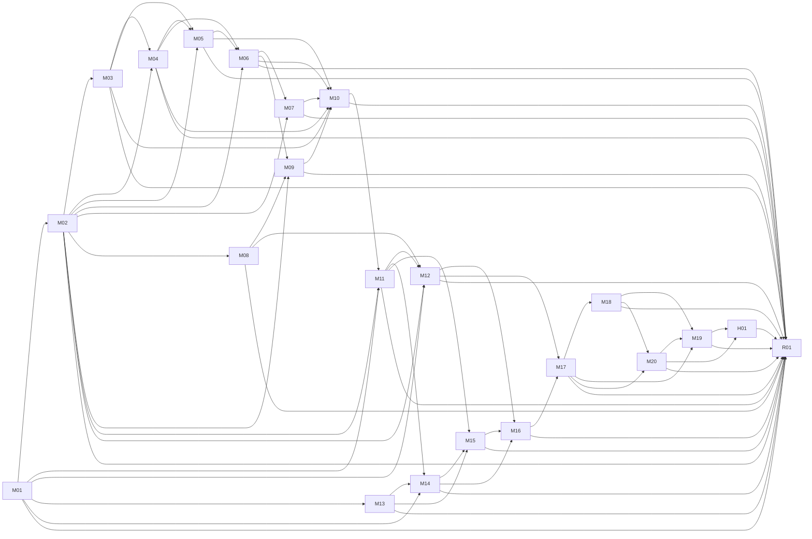

# ReviewLens 实现计划（PLAN）

> **状态：** Open Design 门禁已关闭；Probe 01 冷启动已完成并因 T01.1 歧义暂停，反馈修订已完成；用户已最终确认修订并于 2026-08-08 明确解除 `AGENTS.md` 阶段限制。正式实现现从 T01 开始；后续任务、测试、容器、CI 与部署仍须逐项真实执行和验证。
>
> **执行前置条件：** Open Design 门禁已关闭；Probe 01 已完成本轮 1—2 个 task 的冷启动门槛并已记录/修订；用户已最终确认修订后的 SPEC/PLAN，并明确解除 `AGENTS.md` 阶段限制。前置条件均已满足；必须从 T01 依赖顺序开始执行。

## 1. 目标、边界与执行规则

**目标：** 交付 ReviewLens：面向个人学生开发者的自托管 Git Diff 风险审查工具。私有模式保存已脱敏的报告并可在本机受限入口解锁 OpenAI 凭据；公网 Demo 固定使用无状态 Mock，不保存访客数据且不开放凭据管理。

**技术边界：** Python 3.12、FastAPI、Pydantic v2、SQLAlchemy 2、Alembic、SQLite、`cryptography`、官方 OpenAI Python SDK、pytest；React、TypeScript、Vite、MUI、原生 `fetch`、Vitest、React Testing Library；Docker/OCI、Docker Compose、GitHub Actions、NJU GitLab CI。首期容器交付平台是 `linux/amd64`；Windows 11 x64 + Docker Desktop（Linux containers）是本地支持环境。

**UI 设计兼容性门禁（设计阶段已关闭）：** 固定采用 Open Design 的 `linear-app` 设计系统（`design-systems/linear-app/DESIGN.md`）和本机已安装的 `web-design-guidelines` skill（`skills/web-design-guidelines/SKILL.md`）。已实际读取上游 `DESIGN.md` 并据此形成 SPEC §6.3.1；已按 skill 的固定指南审阅 SPEC §6.3，并补充语义控件、`focus-visible`、`aria-live`、错误焦点、粘贴和减弱动效要求。`linear-app` 是可读取的 design-system 文档资源，直接读取并用于规约是其真实使用；没有伪称存在 `od` CLI。真实 source/context/产出已记入 `SPEC_PROCESS.md` 与 `AGENT_LOG.md`。MUI 仍只是组件库，不能替代 Open Design；M13 只能基于此固定选择产出后续 UI 方向与可访问性设计，不再检查、安装、替换或决定是否采用 Open Design。

### 1.1 不可变执行约束

- 所有确定性代码 Finding 只归因于新增行；仅结构和规模规则可使用完整 Diff 元数据。所有输出、持久化、日志和导出均先经过 `FindingRedactor`。
- 私有与 Demo 共享 parser、rules、去重和风险聚合；Demo 不注册历史、重试、凭据路由，不写 SQLite，不发 OpenAI 网络请求。
- 所有任务严格执行 RED → GREEN → REFACTOR。每个 RED/GREEN 命令均列在本计划中；执行时只记录真实输出，绝不伪造“通过”。
- 每个 `Txx.yy` 是足够小、可由一个全新 implementation subagent 在一次独立 session 中完成的 task；其内部由同一 subagent 顺序执行约 2–5 分钟的写失败测试 → RED → 最小实现 → GREEN → 最小 REFACTOR → review/commit steps。不得把这些步骤拆给多个 agent，也不得声称整个 crypto、Docker 或部署 task 本身只需 2–5 分钟。T01–T20 是里程碑，不是可单独派发的实现任务。
- 每个里程碑拥有独立的 `codex/...` 分支和 worktree。里程碑合并前必须创建 GitHub PR、创建或同步 NJU GitLab MR、完成先规约符合性、后代码质量的两阶段评审；存在 Critical 问题必须修复并复审后才能继续。
- 每个已完成微任务才可在本计划回填真实 commit hash；每个里程碑的 PR/MR URL、review 结论、RED/GREEN 证据和人工介入均只在真实发生后记录到 `AGENT_LOG.md`。
- 真实 API Key、主密码、私有 Diff、原始 prompt/response、凭据片段和未经验证的部署 URL 均不得进入提交、测试 fixture、日志、镜像、文档或截图。

### 1.2 未来工作树、PR/MR 和合并协议

在实现解锁后，对每个里程碑使用以下真实流程；以下命令是未来操作说明，当前不得执行：

1. 将当前里程碑表中已声明的实际 branch 名、worktree 名和已核实的基线 commit 分别赋给 `$branch`、`$worktree`、`$baselineCommit`，再执行 `git worktree add -b $branch $worktree $baselineCommit`。
2. 所有 `Txx.yy` 仅在该 worktree 的分支上顺序提交；一项任务只能由新鲜 subagent 完成。
3. 里程碑所有任务经两阶段评审后，使用 `git push -u origin $branch` 推送 GitHub，并创建 GitHub PR；将同一提交历史推送 NJU GitLab 并创建 MR。真实远程地址与 PR/MR URL 在产生后再写入日志，不在此虚构。
4. 以 `superpowers:finishing-a-development-branch` 决定合并或保留分支。只有双端 review、必需 CI 和用户/仓库策略均满足时才合并；没有合并的分支保留并注明原因。

### 1.3 精确命令的解释

下表的命令是**解锁后**在声明 cwd 执行的精确命令。首次 T01 会建立其中所需的包脚本与测试配置；在此之前它们不应被运行。`-q` 令 pytest 以单一测试节点给出结果；Vitest 使用 `--run` 禁用 watch。

- 后端卡片已逐项给出：`cd apps/api; pytest … -q`。
- 前端卡片已逐项给出：`cd apps/web; npm run test -- --run … -t "…"`。
- 交付命令格式由 T17 建立的真实脚本提供；禁止把尚未存在的脚本运行结果写成证据。

所有卡片中的文件路径均以仓库根目录为基准：后端表中的 `app/...` 和 `tests/...` 分别精确展开为 `apps/api/app/...` 与 `apps/api/tests/...`；前端表中的 `src/...` 和 `tests/...` 分别精确展开为 `apps/web/src/...` 与 `apps/web/tests/...`。命令的 cwd 与这个展开规则共同消除路径歧义。

## 2. 未来文件边界

以下均为未来目标路径，当前阶段不得创建：

| 区域 | 未来路径 |
| --- | --- |
| 后端基础 | `apps/api/pyproject.toml`、`apps/api/app/main.py`、`apps/api/app/config/`、`apps/api/app/models/`、`apps/api/tests/` |
| Diff 与规则 | `apps/api/app/diff_parser/`、`apps/api/app/rules/` |
| 审查安全 | `apps/api/app/reviews/`、`apps/api/app/providers/`、`apps/api/app/credentials/` |
| 持久化与 HTTP | `apps/api/app/persistence/`、`apps/api/app/api/`、`apps/api/app/observability/`、`apps/api/alembic/` |
| Web | `apps/web/src/`、`apps/web/tests/` |
| 交付 | 根目录 `Dockerfile`、`.dockerignore`、`compose.private.yaml`、`compose.demo.yaml`、`scripts/verify-container-start.*`、`Makefile`、`.github/workflows/`、`.gitlab-ci.yml` |

## 3. 共享接口合同

- `ReviewMode`: `private` 或 `demo`。
- `AppSettings`: `mode: Literal["private", "demo"]`；应用工厂不得自行读取环境变量。
- `create_app(settings: AppSettings) -> FastAPI`：仅接受显式注入的已校验设置，并将 `settings.mode` 暴露为 `app.state.settings.mode`，供启动合同测试观察。
- `load_settings(env: Mapping[str, str]) -> AppSettings`：唯一读取 `APP_MODE` 的配置入口；在 T01.3 引入，未知值必须拒绝，且不得改变 `create_app` 的签名。
- `create_runtime_app() -> FastAPI`：唯一生产/ASGI bootstrap，固定执行 `create_app(load_settings(os.environ))`；生产服务器与 Docker runtime 仅通过此 factory 启动。缺失或非法 `APP_MODE` 必须造成启动配置失败，不得默认或猜测 mode。
- `NormalizedDiff`: 规范化 UTF-8 内容、64 位小写 SHA-256、字节数、行数。
- `ParsedDiff`: 文件、hunk、新增行、新文件行号、状态、文件统计和完整 Diff 元数据。
- `FindingDraft`: 仅限请求内存、可能含原始上下文的中间结果。
- `SanitizedFinding`: 经统一脱敏、可持久化/API/导出/日志使用的 Finding。
- `FindingRedactor`: `sanitize(finding_draft) -> SanitizedFinding`；`sanitize_review_payload(review_input) -> review_input`。
- `ReviewProvider`: `review(review_input) -> ProviderResult`；实现为 `OpenAIReviewProvider` 和 `MockReviewProvider`。
- `ReportRepository`: 私有 `SqliteReportRepository` 与 Demo `NoopReportRepository`。
- `ReviewService`: `create_review`、`retry_ai_review`、`get_report`、`list_reports`、`delete_report`、`clear_reports`。

## 4. 依赖图与可并行边界

本图**由各里程碑的 `Depends on` 逐项反推**；若下文变更依赖，必须同步重画本图后才可审核。

| 里程碑 | Depends on | 可与其并行的里程碑（前置完成后） |
| --- | --- | --- |
| M01 | 无 | 无 |
| M02 | M01 | M13 |
| M03 | M02 | M06、M08、M13 |
| M04 | M02、M03 | M06、M08、M13 |
| M05 | M02、M03、M04 | M06、M08、M13 |
| M06 | M02、M04、M05 | M08、M13 |
| M07 | M02、M06 | M08、M09、M13 |
| M08 | M02 | M03、M06、M13 |
| M09 | M02、M06、M08 | M07、M13 |
| M10 | M03、M04、M05、M06、M07、M09 | M13 |
| M11 | M01、M02、M10 | M13 |
| M12 | M01、M02、M08、M11 | M13 |
| M13 | M01 | 与 M02–M12（按各自前置） |
| M14 | M01、M11、M13 | 无 |
| M15 | M11、M13、M14 | 无 |
| M16 | M12、M14、M15 | 无 |
| M17 | M12、M16 | 无 |
| M18 | M17 | 无 |
| M19 | M17、M18、M20 | 无 |
| M20 | M17、M18 | 无 |

## 5. 微任务卡片

每张卡片是可由一个新鲜 subagent 在一次 session 完成的**正式任务**。同一里程碑内的卡片按编号顺序执行；同一个 implementation subagent 在该卡片内顺序完成写失败测试、RED、最小实现、GREEN、最小 REFACTOR、两阶段 review 与 commit。每个执行 step 应控制在约 2–5 分钟；卡片整体不得声称固定只需 2–5 分钟。卡片的 `RED` 与 `GREEN` 使用相同命令；RED 的预期是该测试因目标尚不存在或行为错误而失败，GREEN 的预期是该单一节点显示 `1 passed`（Vitest 为 `1 passed`）。在每个卡片提交前执行只影响该卡片的最小重构；不能把后续卡片的范围带入当前提交。

### M01 — 基础工作区

**Branch/worktree：** `codex/foundation` / `../reviewlens-foundation`
**Depends on：** 无
**里程碑 PR/MR：** M01.1–M01.4 都通过两阶段评审后创建；合并/保留遵循 §1.2。

| Task | 文件与最小目标 | RED（cwd 与命令）/预期 | GREEN（同一命令）/预期 |
| --- | --- | --- | --- |
| T01.1 | 创建 `apps/api/pyproject.toml`、`app/config/settings.py`、`app/main.py`、`tests/test_app_bootstrap.py`。`pyproject.toml` 固定 `requires-python >=3.12,<3.13`，声明 FastAPI、Pydantic v2、Uvicorn 与 pytest 的有上界兼容范围，并在本 task 写入实际 lockfile；`AppSettings(mode: Literal["private", "demo"])` 与 `create_app(settings)` 使用显式注入，工厂不读取环境变量。测试以 `AppSettings(mode="private")` 调用工厂，唯一启动合同为“返回 `FastAPI` 且 `app.state.settings.mode == "private"`”。 **真实完成提交：** `c3e640bd44b42cec1751d3a19c9722f1040e092d` (`feat(api): bootstrap explicit app factory`)；2026-08-09 经规约符合性与代码质量评审批准。 | `cd apps/api; pytest tests/test_app_bootstrap.py::test_create_app_preserves_explicit_private_mode -q`；模块/工厂/可观察 mode 合同缺失或错误。 | 同一命令；`1 passed`。 |
| T01.2 | 创建 `apps/web/package.json`、`vite.config.ts`、`src/main.tsx`、`src/App.tsx`、`tests/app_bootstrap.test.tsx`；只渲染 mode shell。 **真实完成提交：** `e088f9b` (`feat(web): add mode shell bootstrap`)；审查发现的 Vite/Vitest 依赖安全问题已由 `f0759d4` (`chore(web): patch vite and vitest`) 修复。2026-08-09 经规约符合性复审与代码质量审查批准。 | `cd apps/web; npm.cmd run test -- --run tests/app_bootstrap.test.tsx -t "renders the mode shell"`；模块不存在或断言失败。 | 同一命令；`1 passed`。 |
| T01.3 | 在既有 `app/config/settings.py` 与 `tests/test_app_bootstrap.py` 中只加入 `load_settings(env)`：它是唯一读取 `APP_MODE` 的入口，返回 `AppSettings`；缺失或未知值必须在调用 `create_app` 前拒绝，且不得修改 T01.1 的 `create_app(settings)` 合同。 **真实完成提交：** `3d028f4` (`feat(api): load app mode settings`)；规约审查发现配置错误会回显原始输入后，已由 `d41d6e0` (`fix(api): redact app mode configuration errors`) 修复。2026-08-09 经规约符合性复审与代码质量审查批准。 | `cd apps/api; py -3.12 -m pytest tests/test_app_bootstrap.py::test_load_settings_rejects_unknown_app_mode -q`；未知 `APP_MODE` 未被拒绝或工厂签名被改动。 | 同一命令；`1 passed`。 |
| T01.4 | 在既有 `app/main.py` 与 `tests/test_app_bootstrap.py` 中只加入 `create_runtime_app()`：唯一实现为 `create_app(load_settings(os.environ))`；生产 ASGI/Docker runtime 必须使用此 factory。单个测试先设置 `APP_MODE=private` 并断言可观察 private mode，再在同一测试内分别验证缺失和非法值均在启动前失败。 **真实完成提交：** `49956e5` (`feat(api): add runtime app factory`)；2026-08-09 经规约符合性与代码质量审查批准。 | `cd apps/api; py -3.12 -m pytest tests/test_app_bootstrap.py::test_create_runtime_app_uses_env_and_rejects_missing_or_invalid_mode -q`；未组合 loader/factory，或缺失/非法 mode 被默认接受。 | 同一命令；`1 passed`。 |

### M02 — 领域合同与错误词汇

**Branch/worktree：** `codex/domain-contracts` / `../reviewlens-domain-contracts`
**Depends on：** M01

| Task | 文件与最小目标 | RED / 预期 | GREEN / 预期 |
| --- | --- | --- | --- |
| T02.1 | `app/models/domain.py`、`tests/models/test_domain_contracts.py`：只定义 `ReviewMode`、Severity、Source、AI 状态。 **真实完成提交：** `9d13a90` (`feat(api): add domain vocabularies`)；2026-08-09 经规约符合性与代码质量审查批准。 | `cd apps/api; py -3.12 -m pytest tests/models/test_domain_contracts.py::test_review_mode_and_severity_values_are_fixed -q`；枚举或值缺失。 | 同一命令；`1 passed`。 |
| T02.2 | `app/models/errors.py`、`tests/models/test_error_contracts.py`：只定义稳定公开错误代码。 **真实完成提交：** `4aee17c` (`feat(api): add public error codes`)；2026-08-09 经规约符合性与代码质量审查批准。 | `cd apps/api; py -3.12 -m pytest tests/models/test_error_contracts.py::test_input_error_codes_are_stable -q`；代码缺失或变化。 | 同一命令；`1 passed`。 |
| T02.3 | `app/models/api.py`、`tests/models/test_domain_contracts.py`：只定义 `FindingDraft`/`SanitizedFinding`/`ReportView` 的必需字段。 **真实完成提交：** `54409db` (`feat(api): add sanitized report contracts`)；2026-08-09 经规约符合性与代码质量审查批准。 | `cd apps/api; py -3.12 -m pytest tests/models/test_domain_contracts.py::test_report_view_requires_sanitized_findings -q`；模型不存在或接受 draft。 | 同一命令；`1 passed`。 |
| T02.4 | `app/config/mode_policy.py`、`tests/models/test_error_contracts.py`：只定义 Demo 禁用能力矩阵。 **真实完成提交：** `026cf5c` (`feat(api): add demo mode capability policy`) 与 `1193797` (`test(api): cover private mode capability policy`)；2026-08-09 经规约符合性与代码质量审查批准。 | `cd apps/api; py -3.12 -m pytest tests/models/test_error_contracts.py::test_demo_disables_private_features -q`；Demo 未禁用私有能力。 | 同一命令；`1 passed`。 |

### M03 — Diff 规范化与解析

**Branch/worktree：** `codex/diff-parser` / `.worktrees/diff-parser`（原 `../reviewlens-diff-parser` 因实现 subagent 无写权限，经用户于 2026-08-09 明确授权后迁移；仍为独立 Git 忽略 worktree）
**Depends on：** M02

**模块全分支复核：** 2026-08-10，独立审查覆盖 `650db9a..8a67245` 的 M03 完整差异；先前跨任务发现的 hunk/统计、生命周期/binary 和非 LF 行边界缺口均已由 T03.7–T03.9 修复。最终结论为 APPROVED、无可操作问题；控制器随后以 Python 3.12 运行完整后端套件，`32 passed in 0.57s`。

| Task | 文件与最小目标 | RED / 预期 | GREEN / 预期 |
| --- | --- | --- | --- |
| T03.1 | `diff_parser/normalizer.py`、`tests/diff_parser/test_normalizer.py`：空输入与 UTF-8 拒绝。 **真实完成提交：** `b86e296` (`feat(api): validate diff input encoding`)；2026-08-09 经规约符合性与代码质量审查批准。 | `cd apps/api; py -3.12 -m pytest tests/diff_parser/test_normalizer.py::test_rejects_empty_input -q`；normalizer 缺失或未拒绝。 | 同一命令；`1 passed`。 |
| T03.2 | 同上：BOM 去除、CRLF/CR→LF 与 SHA-256 等价。 **真实完成提交：** `fdaa593` (`feat(api): normalize diff content and digest`)；2026-08-10 经规约符合性与代码质量审查批准。 | `cd apps/api; py -3.12 -m pytest tests/diff_parser/test_normalizer.py::test_crlf_and_lf_have_the_same_digest -q`；摘要不同。 | 同一命令；`1 passed`。 |
| T03.3 | 同上：500 KB、5,000 行硬拒绝，无静默截断。 **真实完成提交：** `4808448` (`feat(api): enforce diff input limits`)；2026-08-10 经规约符合性与代码质量审查批准。 | `cd apps/api; py -3.12 -m pytest tests/diff_parser/test_normalizer.py::test_rejects_over_line_limit -q`；未返回限制错误。 | 同一命令；`1 passed`。 |
| T03.4 | `diff_parser/parser.py`、`tests/diff_parser/test_parser.py`：合法 unified Diff 与新增行的新文件行号。 **真实完成提交：** `cc3055f` (`feat(api): map unified diff added lines`) 与 `325bafc` (`fix(api): preserve plus-prefixed diff additions`)；2026-08-10 经规约符合性审查、质量审查和修复复审批准。 | `cd apps/api; py -3.12 -m pytest tests/diff_parser/test_parser.py::test_maps_added_line_to_new_file_line_number -q`；parser/行号映射缺失。 | 同一命令；`1 passed`。 |
| T03.5 | 同上：重命名、删除、`+++` 头与 binary 元数据。 **真实完成提交：** `bd8421c` (`feat(api): parse diff change metadata`)；2026-08-10 经规约符合性与代码质量审查批准。 | `cd apps/api; py -3.12 -m pytest tests/diff_parser/test_parser.py -q`；重命名、删除、binary 元数据和变更类型缺失。 | 同一命令；`5 passed`（完整后端：`27 passed`）。 |
| T03.6 | 同上：非 unified Diff 的明确拒绝且不创建报告。 **真实完成提交：** `f485f8c` (`feat(api): reject invalid diff format`)；2026-08-10 经规约符合性与代码质量审查批准。 | `cd apps/api; py -3.12 -m pytest tests/diff_parser/test_parser.py::test_rejects_invalid_unified_diff -q`；格式无效内容被接纳。 | 同一命令；`1 passed`（解析器：`6 passed`；完整后端：`28 passed`）。 |
| T03.7 | `diff_parser/parser.py`、`tests/diff_parser/test_parser.py`：补齐冻结的 `ParsedHunk` 与 hunk 内 `context` / `added` / `deleted` 行记录；每行保留旧/新文件行号（不适用侧为 `null`），每文件保留完整 hunk 元数据、`added_line_count` 和 `deleted_line_count`。既有 `AddedLine` 视图保持可用，且只来自新增行。 **真实完成提交：** `434d826` (`feat(api): preserve parsed diff hunks`)；2026-08-10 经规约符合性与代码质量审查批准。 | `cd apps/api; py -3.12 -m pytest tests/diff_parser/test_parser.py::test_parsed_hunk_retains_context_deleted_added_lines_and_counts -q`；hunk、旧行号、删除行或统计缺失。 | 同一命令；`1 passed`（解析器：`7 passed`；完整后端：`29 passed`）。 |
| T03.8 | 同上：将文件生命周期状态固定为 `added` / `modified` / `deleted` / `renamed`，另以独立 `is_binary: bool` 表示二进制能力限制；识别 `new file mode` / `--- /dev/null`，并保留删除或重命名状态，即使文件为 binary。 **真实完成提交：** `63f7296` (`feat(api): separate file lifecycle and binary state`)；2026-08-10 经规约符合性与代码质量审查批准。 | `cd apps/api; py -3.12 -m pytest tests/diff_parser/test_parser.py::test_new_binary_file_has_added_status_and_binary_flag -q`；新文件被标为 modified 或 binary 覆盖生命周期状态。 | 同一命令；`1 passed`（解析器：`8 passed`；完整后端：`30 passed`）。 |
| T03.9 | `diff_parser/normalizer.py`、`diff_parser/parser.py` 与对应测试：规范化后仅 LF 是行边界；`U+2028`、form feed 等合法 UTF-8 内容必须留在同一 Diff 行。行数上限保持 5,000 的既有 trailing-LF 语义，解析器不得漏掉包含这些字符的新增行。 **真实完成提交：** `0428aea` (`fix(api): preserve non-lf diff content`)；2026-08-10 经规约符合性与代码质量审查批准。 | `cd apps/api; py -3.12 -m pytest tests/diff_parser/test_normalizer.py::test_only_lf_is_a_normalized_diff_line_boundary -q`；非 LF 分隔字符被误计行或切断新增行。 | 同一命令；`1 passed`（聚焦双测试：`2 passed`；相关套件：`19 passed`；完整后端：`32 passed`）。 |

### M04 — 固定通用规则集

**Branch/worktree：** `codex/general-rules` / `../reviewlens-general-rules`
**Depends on：** M02、M03

**真实里程碑收尾：** T04.1–T04.7 完成后，M04 全分支复核先发现 GEN-001/GEN-002/GEN-004 的动态值与无目标文本误报边界；第一轮修复提交 `fe32601` 后的 scoped 复审又发现剩余三项保守匹配缺口。经用户要求完成 M04 后，第二轮仅以 `f6f1cab` 修复 whole-value `$NAME`、无目标 SQL 注释和任意位置的动态 HTTP host；fresh final scoped quality re-review 已于 2026-08-10 批准，无 Critical/Important。最终代码验证必须使用 Python 3.12；本轮最终全量后端结果为 `69 passed`。

| Task | 文件与最小目标 | RED / 预期 | GREEN / 预期 |
| --- | --- | --- | --- |
| T04.1 | `rules/catalog.py`、`tests/rules/test_general_rules.py`：只定义不可配置的 `RULESET_VERSION=1.0.0` 与 GEN-001…005 元数据。 **真实完成提交：** `bc1c055` (`feat(api): add fixed general rule catalog`) 与 `79f9bc5` (`test(api): verify fixed ruleset ignores environment`)；2026-08-10 经规约符合性复审和代码质量审查批准。 | `cd apps/api; py -3.12 -m pytest tests/rules/test_general_rules.py::test_ruleset_catalog_is_fixed -q`；`ModuleNotFoundError: No module named 'app.rules'`。补充环境不可配置测试以受控临时 mutation 得到 `99.99.99 != 1.0.0`。 | 固定目录聚焦：`1 passed`；补充覆盖与相关套件：`2 passed`；完整后端：`34 passed`。 |
| T04.2 | `rules/general.py`：仅 GEN-001 高置信凭据，且只扫描新增行。 **真实完成提交：** `cb3bc4d` (`feat(api): detect added credentials`) 与 `294d602` (`fix(api): ignore credential template expressions`)；2026-08-10 经规约符合性复审和代码质量审查批准。 | `cd apps/api; py -3.12 -m pytest tests/rules/test_general_rules.py::test_gen_001_finds_only_added_credential -q`；`ModuleNotFoundError: No module named 'app.rules.general'`。模板表达式回归 RED：错误产生一个 `FindingDraft`。 | 聚焦：`1 passed`；规则套件：`6 passed`；完整后端：`38 passed`。 |
| T04.3 | 同上：仅 GEN-002 高置信危险 shell/数据库破坏操作。 **真实完成提交：** `aca3d57` (`feat(api): detect destructive operations`)、`2864b14` (`test(api): cover benign added remove command`) 与 `bb286a4` (`fix(api): require destructive command targets`)；2026-08-10 经规约符合性复审和代码质量复审批准。 | `cd apps/api; py -3.12 -m pytest tests/rules/test_general_rules.py::test_gen_002_finds_added_destructive_command -q`；缺少 `scan_gen_002`。后续受控 RED：旧 matcher 将 `mkfs # explanation` 误报。 | 规则套件：`12 passed`；完整后端：`44 passed`。 |
| T04.4 | 同上：仅 GEN-003 新增 TODO/FIXME/HACK。 **真实完成提交：** `4e612c4` (`feat(api): detect added work markers`)；2026-08-10 经规约符合性与代码质量审查批准。 | `cd apps/api; py -3.12 -m pytest tests/rules/test_general_rules.py::test_gen_003_finds_added_todo_marker -q`；缺少 `scan_gen_003`。 | 聚焦：`1 passed`；规则套件：`16 passed`；完整后端：`48 passed`。 |
| T04.5 | 同上：仅 GEN-004 非 loopback `http://` 硬编码地址。 **真实完成提交：** `12cf519` (`feat(api): detect non-loopback http`)；2026-08-10 经规约符合性与代码质量审查批准。 | `cd apps/api; py -3.12 -m pytest tests/rules/test_general_rules.py::test_gen_004_ignores_loopback_http -q`；缺少 `scan_gen_004`。 | 聚焦：`5 passed`；规则套件：`24 passed`；完整后端：`56 passed`。 |
| T04.6 | `rules/engine.py`：仅 GEN-005 文件级变更规模，行号为 `null`。 **真实完成提交：** `039f421` (`feat(api): detect oversized file changes`)；2026-08-10 经规约符合性与代码质量审查批准。 | `cd apps/api; py -3.12 -m pytest tests/rules/test_general_rules.py::test_gen_005_is_file_level -q`；缺少 `app.rules.engine`。 | 聚焦：`1 passed`；规则套件：`25 passed`；完整后端：`57 passed`。 |
| T04.7 | `tests/rules/test_added_line_scope.py`：删除、上下文、文件头均不得触发 GEN-001…GEN-004。 **真实完成提交：** `079d018` (`test(api): enforce added-line rule scope`)；2026-08-10 经规约符合性与代码质量审查批准。 | 受控临时 mutation 将删除 hunk 行纳入 GEN-001，`py -3.12 -m pytest tests/rules/test_added_line_scope.py::test_deleted_secret_does_not_create_finding -q` 失败并产生 Finding。 | 范围套件：`3 passed`；规则套件：`28 passed`；完整后端：`60 passed`。 |

### M05 — JS/TS 规则、去重与等级

**Branch/worktree：** `codex/js-rules-risk` / `../reviewlens-js-rules-risk`
**Depends on：** M02、M03、M04

| Task | 文件与最小目标 | RED / 预期 | GREEN / 预期 |
| --- | --- | --- | --- |
| T05.1 | `rules/javascript.py`、`tests/rules/test_javascript_rules.py`：仅 JS-001 `console.log`/`console.debug`。 **真实完成提交：** `918cb8a` (`feat(api): detect JS console output`)；2026-08-11 经规约符合性审查批准、代码质量审查修复后 scoped 复审批准。 | `cd apps/api; py -3.12 -m pytest tests/rules/test_javascript_rules.py::test_js_001_finds_added_console_log -q`；初始 RED：`ModuleNotFoundError: No module named 'app.rules.javascript'`。质量修复 RED：`3 failed, 8 passed`，覆盖模板插值漏报及跨行块注释误报。 | 初始聚焦：`1 passed`；修复后 JS 测试：`11 passed`；规则套件：`48 passed`；完整后端：`80 passed`，均为 Python 3.12。 |
| T05.2 | 同上：仅 JS-002 `debugger`。 **真实完成提交：** `20a1205` (`feat(api): detect JS debugger statements`)；2026-08-11 经规约符合性审查批准、质量审查修复后 scoped 复审批准。 | `cd apps/api; py -3.12 -m pytest tests/rules/test_javascript_rules.py::test_js_002_finds_added_debugger -q`；初始 RED：`ImportError: cannot import name 'scan_js_002'`。质量修复 RED：ASI 形态 `if (enabled) { debugger }` 未命中。 | 初始聚焦：`1 passed`；质量修复聚焦：`1 passed`；修复后 JS 测试：`20 passed`；完整后端：`89 passed`，均为 Python 3.12。 |
| T05.3 | 同上：仅 JS-003 `eval()`。 | `cd apps/api; pytest tests/rules/test_javascript_rules.py::test_js_003_finds_added_eval -q`；未命中。 | 同一命令；`1 passed`。 |
| T05.4 | 同上：仅 JS-004 `innerHTML`/`dangerouslySetInnerHTML`。 | `cd apps/api; pytest tests/rules/test_javascript_rules.py::test_js_004_finds_added_inner_html -q`；未命中。 | 同一命令；`1 passed`。 |
| T05.5 | 同上：仅 JS-005 空/吞异常 `catch`；允许上下文但只能锚定新增行。 | `cd apps/api; pytest tests/rules/test_javascript_rules.py::test_js_005_anchors_empty_catch_to_added_line -q`；错锚或未命中。 | 同一命令；`1 passed`。 |
| T05.6 | 同上：仅 JS-006 可明确识别的未 `await`/未 `return`/未处理 `fetch()`。 | `cd apps/api; pytest tests/rules/test_javascript_rules.py::test_js_006_finds_unhandled_added_fetch -q`；未命中或误报不确定语境。 | 同一命令；`1 passed`。 |
| T05.7 | 同上：仅 JS-007 新增显式 `any` 的低等级提示。 | `cd apps/api; pytest tests/rules/test_javascript_rules.py::test_js_007_finds_added_explicit_any -q`；未命中。 | 同一命令；`1 passed`。 |
| T05.8 | 同上：不支持语言与上下文/删除行均不能触发 JS 规则。 | `cd apps/api; pytest tests/rules/test_javascript_rules.py::test_js_rules_do_not_apply_to_python -q`；`.py` 被误判。 | 同一命令；`1 passed`。 |
| T05.9 | `rules/dedupe.py`、`tests/rules/test_dedupe.py`：规则、路径、新行号、标准化位置去重。 | `cd apps/api; pytest tests/rules/test_dedupe.py::test_same_added_statement_is_counted_once -q`；重复保留。 | 同一命令；`1 passed`。 |
| T05.10 | `rules/risk.py`、`tests/rules/test_risk.py`：固定阈值、稳定排序；AI 不计入。 | `cd apps/api; pytest tests/rules/test_risk.py::test_three_deduplicated_medium_findings_escalate_to_high -q`；等级错误。 | 同一命令；`1 passed`。 |

### M06 — Finding 脱敏边界

**Branch/worktree：** `codex/finding-redaction` / `../reviewlens-finding-redaction`
**Depends on：** M02、M04、M05

| Task | 文件与最小目标 | RED / 预期 | GREEN / 预期 |
| --- | --- | --- | --- |
| T06.1 | `reviews/redaction.py`、`tests/reviews/test_finding_redaction.py`：GEN-001 中真实样式的虚构凭据替换为 `[REDACTED_CREDENTIAL]`。 | `cd apps/api; pytest tests/reviews/test_finding_redaction.py::test_gen_001_never_retains_secret_or_tail -q`；完整值/尾号仍可见。 | 同一命令；`1 passed`。 |
| T06.2 | `reviews/schemas.py`、`tests/reviews/test_redacted_schema.py`：`SanitizedFinding` 拒绝 raw 字段。 | `cd apps/api; pytest tests/reviews/test_redacted_schema.py::test_sanitized_finding_has_no_raw_secret_field -q`；raw 字段仍可构造。 | 同一命令；`1 passed`。 |
| T06.3 | 同上：发送 OpenAI 前对高置信凭据掩码，AI Finding 入库/导出前再次脱敏。 | `cd apps/api; pytest tests/reviews/test_finding_redaction.py::test_ai_payload_and_ai_finding_are_redacted -q`；虚构 secret 泄漏。 | 同一命令；`1 passed`。 |

### M07 — SQLite 与报告仓储

**Branch/worktree：** `codex/sqlite-repositories` / `../reviewlens-sqlite-repositories`
**Depends on：** M02、M06

| Task | 文件与最小目标 | RED / 预期 | GREEN / 预期 |
| --- | --- | --- | --- |
| T07.1 | `persistence/models.py`、`tests/persistence/test_report_repository.py`：Report、FileStat、Finding、AIReviewAttempt 关系。 | `cd apps/api; pytest tests/persistence/test_report_repository.py::test_report_persists_sanitized_children -q`；模型/关联缺失。 | 同一命令；`1 passed`。 |
| T07.2 | `database.py`、`alembic/versions/0001_report_schema.py`：`Report.id` 主键；`FileStat.report_id`、`Finding.report_id`、`AIReviewAttempt.report_id` 引用它的外键和级联；FileStat `(report_id,path)` 唯一。 | `cd apps/api; pytest tests/persistence/test_report_repository.py::test_report_children_reference_report_primary_key -q`；主键、外键或唯一约束不存在。 | 同一命令；`1 passed`。 |
| T07.3 | `repositories.py`、`tests/persistence/test_cascade_constraints.py`：硬删除级联，单报告至多一个 PENDING 尝试。 | `cd apps/api; pytest tests/persistence/test_cascade_constraints.py::test_deleting_report_cascades_all_children -q`；孤儿记录仍在。 | 同一命令；`1 passed`。 |
| T07.4 | 同上：Demo `NoopReportRepository` 不产生写入，原始 Diff 不能进 schema。 | `cd apps/api; pytest tests/persistence/test_report_repository.py::test_noop_repository_does_not_write -q`；发现写入。 | 同一命令；`1 passed`。 |

### M08 — 加密保险箱

**Branch/worktree：** `codex/credential-vault` / `../reviewlens-credential-vault`
**Depends on：** M02

| Task | 文件与最小目标 | RED / 预期 | GREEN / 预期 |
| --- | --- | --- | --- |
| T08.1 | `credentials/vault.py`、`tests/credentials/test_vault_lifecycle.py`：固定 scrypt + AES-256-GCM 创建及原子替换。 | `cd apps/api; pytest tests/credentials/test_vault_lifecycle.py::test_initialization_uses_scrypt_and_aes_256_gcm_without_plaintext_key -q`；vault/算法/加密缺失。 | 同一命令；`1 passed`。 |
| T08.2 | `credentials/service.py`：正确主密码仅在进程内解锁。 | `cd apps/api; pytest tests/credentials/test_vault_lifecycle.py::test_correct_password_unlocks_in_memory_only -q`；无法解锁或泄漏。 | 同一命令；`1 passed`。 |
| T08.3 | 同上、`test_vault_failures.py`：统一错误、递增短延迟、损坏保险箱不可用。 | `cd apps/api; pytest tests/credentials/test_vault_failures.py::test_wrong_password_returns_uniform_failure -q`；错误泄露密码学细节。 | 同一命令；`1 passed`。 |
| T08.4 | 同上：更新轮换、清除、重启锁定及 status 尾号掩码。 | `cd apps/api; pytest tests/credentials/test_vault_lifecycle.py::test_clear_removes_file_and_memory_credential -q`；文件或内存仍存在。 | 同一命令；`1 passed`。 |

### M09 — OpenAI 与 Mock Provider

**Branch/worktree：** `codex/review-providers` / `../reviewlens-review-providers`
**Depends on：** M02、M06、M08

| Task | 文件与最小目标 | RED / 预期 | GREEN / 预期 |
| --- | --- | --- | --- |
| T09.1 | `providers/base.py`、`mock_provider.py`、`tests/providers/test_mock_provider.py`：稳定的无网络 Mock。 | `cd apps/api; pytest tests/providers/test_mock_provider.py::test_mock_result_is_repeatable_and_network_free -q`；provider 缺失或结果不稳定。 | 同一命令；`1 passed`。 |
| T09.2 | `openai_provider.py`、`tests/providers/test_openai_error_mapping.py`：官方 SDK、`store=false`、30 秒超时和公开错误映射。 | `cd apps/api; pytest tests/providers/test_openai_error_mapping.py::test_timeout_maps_to_public_timeout_without_raw_body -q`；错误映射缺失/泄漏。 | 同一命令；`1 passed`。 |
| T09.3 | 同上、`test_provider_schema_validation.py`：Pydantic 验证非法结构化输出。 | `cd apps/api; pytest tests/providers/test_provider_schema_validation.py::test_invalid_response_creates_no_ai_finding -q`；非法结果被接纳。 | 同一命令；`1 passed`。 |
| T09.4 | 同上：只允许官方 Provider、无自定义 Base URL，输入先脱敏。 | `cd apps/api; pytest tests/providers/test_openai_error_mapping.py::test_provider_configuration_rejects_custom_base_url -q`；自定义 endpoint 可用。 | 同一命令；`1 passed`。 |

### M10 — 审查编排与 AI 重试

**Branch/worktree：** `codex/review-service` / `../reviewlens-review-service`
**Depends on：** M03、M04、M05、M06、M07、M09

| Task | 文件与最小目标 | RED / 预期 | GREEN / 预期 |
| --- | --- | --- | --- |
| T10.1 | `reviews/service.py`、`tests/reviews/test_review_service.py`：仅完成 normalize/parse/rules/dedupe/risk 的确定性 `ReportDraft`。 | `cd apps/api; pytest tests/reviews/test_review_service.py::test_create_review_calculates_deterministic_report -q`；草稿/总等级缺失。 | 同一命令；`1 passed`。 |
| T10.2 | 同上：仅将私有模式的已脱敏确定性报告事务持久化。 | `cd apps/api; pytest tests/reviews/test_review_service.py::test_deterministic_report_persists_before_ai_call -q`；顺序/报告缺失。 | 同一命令；`1 passed`。 |
| T10.3 | 同上：仅追加一次 AI 调用及成功/失败状态，失败不改变确定性结果。 | `cd apps/api; pytest tests/reviews/test_review_service.py::test_ai_failure_preserves_deterministic_report -q`；报告丢失/等级变化。 | 同一命令；`1 passed`。 |
| T10.4 | `tests/reviews/test_ai_retry.py`：摘要相同仅重跑 AI，不新建报告。 | `cd apps/api; pytest tests/reviews/test_ai_retry.py::test_matching_retry_does_not_rerun_deterministic_rules -q`；重新扫描或新建报告。 | 同一命令；`1 passed`。 |
| T10.5 | 同上：仅拒绝摘要不一致和并发 PENDING 重试。 | `cd apps/api; pytest tests/reviews/test_ai_retry.py::test_second_pending_retry_is_rejected -q`；重复计费路径可达。 | 同一命令；`1 passed`。 |
| T10.6 | `tests/reviews/test_demo_lifecycle.py`：Demo 使用同一内核但无持久化、无历史、无重试。 | `cd apps/api; pytest tests/reviews/test_demo_lifecycle.py::test_demo_review_has_no_persisted_report -q`；Demo 写入。 | 同一命令；`1 passed`。 |

### M11 — 审查、历史和导出 API

**Branch/worktree：** `codex/review-api` / `../reviewlens-review-api`
**Depends on：** M01、M02、M10

| Task | 文件与最小目标 | RED / 预期 | GREEN / 预期 |
| --- | --- | --- | --- |
| T11.1 | `api/reviews.py`、`tests/api/test_reviews_api.py`：`POST /api/v1/reviews`。 | `cd apps/api; pytest tests/api/test_reviews_api.py::test_post_review_returns_sanitized_report -q`；路由 404/输出未脱敏。 | 同一命令；`1 passed`。 |
| T11.2 | 同上：私有 history/detail/delete/clear 路由。 | `cd apps/api; pytest tests/api/test_reviews_api.py::test_private_history_and_hard_delete -q`；路由或删除行为错误。 | 同一命令；`1 passed`。 |
| T11.3 | `api/exports.py`、`tests/api/test_export_api.py`：私有 Markdown 导出无完整 Diff、无缓存。 | `cd apps/api; pytest tests/api/test_export_api.py::test_export_contains_all_sanitized_findings_without_diff -q`；导出漏项/泄漏。 | 同一命令；`1 passed`。 |
| T11.4 | `api/reviews.py`、`tests/api/test_reviews_api.py`：私有 `POST /api/v1/reviews/{report_id}/ai-retry` 将摘要一致的 Diff 交给 `retry_ai_review`。 | `cd apps/api; pytest tests/api/test_reviews_api.py::test_ai_retry_route_accepts_matching_digest -q`；路由 404 或未调用 retry 服务。 | 同一命令；`1 passed`。 |
| T11.5 | 同上：相同 retry route 对摘要不一致与已有 `PENDING` 尝试返回稳定拒绝错误。 | `cd apps/api; pytest tests/api/test_reviews_api.py::test_ai_retry_route_rejects_digest_mismatch_and_pending_attempt -q`；错误分支未拒绝。 | 同一命令；`1 passed`。 |
| T11.6 | `tests/api/test_demo_routes.py`：Demo 不注册历史、导出和 AI retry 私有 API。 | `cd apps/api; pytest tests/api/test_demo_routes.py::test_demo_ai_retry_route_is_not_registered -q`；Demo 路由可达。 | 同一命令；`1 passed`。 |

### M12 — 管理、健康、限流和日志

**Branch/worktree：** `codex/admin-observability` / `../reviewlens-admin-observability`
**Depends on：** M01、M02、M08、M11

| Task | 文件与最小目标 | RED / 预期 | GREEN / 预期 |
| --- | --- | --- | --- |
| T12.1 | `api/health.py`、`tests/api/test_health.py`：`/health` 不依赖 OpenAI。 | `cd apps/api; pytest tests/api/test_health.py::test_health_is_live_when_vault_is_locked -q`；health 错误失败。 | 同一命令；`1 passed`。 |
| T12.2 | 同上：`/ready` 校验本地配置/DB/ruleset，不因 OpenAI 未配而未就绪。 | `cd apps/api; pytest tests/api/test_health.py::test_ready_checks_private_database_but_not_openai -q`；就绪语义错误。 | 同一命令；`1 passed`。 |
| T12.3 | `api/admin.py`、`tests/api/test_admin_loopback.py`：直接宿主机仅 loopback/Unix socket admin listener；Docker 私有模式允许独立容器 admin listener，由 M17 仅发布到宿主机 loopback；Demo 不注册。 | `cd apps/api; pytest tests/api/test_admin_loopback.py::test_demo_registers_no_vault_route -q`；Demo 路由存在。 | 同一命令；`1 passed`。 |
| T12.4 | `api/middleware.py`、`tests/api/test_rate_limit.py`：Demo 10 分钟 10 次、burst 3、可信代理限定。 | `cd apps/api; pytest tests/api/test_rate_limit.py::test_demo_returns_429_after_configured_limit -q`；没有 429。 | 同一命令；`1 passed`。 |
| T12.5 | `observability/logging.py`、`tests/api/test_log_redaction.py`：关联 ID 与允许字段，不记录虚构 Diff/凭据。 | `cd apps/api; pytest tests/api/test_log_redaction.py::test_structured_log_excludes_diff_and_secret -q`；敏感样本出现。 | 同一命令；`1 passed`。 |

### M13 — 基于既定 Open Design 的 UI 方向与可访问性合同

**Branch/worktree：** `codex/ui-direction` / `../reviewlens-ui-direction`
**Depends on：** M01

这是一组设计文档任务，不产生业务代码，故不存在 RED/GREEN 测试；每项的验证是可审计的设计检查。其硬前提（本计划 §1 的 Open Design 门禁）已在设计阶段以真实 source/context/产出关闭；冷启动仍必须先完成，且不得虚构未来 skill 输出、实现或课程方答复。

| Task | 文件与最小目标 | 验证 |
| --- | --- | --- |
| T13.1 | 创建 `docs/design/reviewlens-ui-direction.md`：使用已可实际访问的 `linear-app` 设计系统，规定 Diff 输入、处理中、确定性结果、AI 状态、Demo、能力受限、空历史和删除确认的信息层级。 | 规约评审核对文档只使用既定 `linear-app`，无新的 system/skill 或 fallback 产品决策。 |
| T13.2 | 创建 `docs/design/reviewlens-accessibility-contract.md`：以既定 `web-design-guidelines` 的真实可追溯使用结果为依据，规定键盘路径、焦点、标签、非颜色等级、错误、加载和桌面窄窗口行为。 | 核对实际 skill context/产出已留痕，且每项可访问性要求与 SPEC §6.3 一致。 |
| T13.3 | 在 `docs/design/reviewlens-ui-direction.md` 规定桌面优先布局、私有/Demo 持续可见差异、组件职责和状态文案。 | 规约评审确认未新增登录、在线共享、团队权限或其他超范围能力。 |
| T13.4 | 在上述两份文档中建立页面状态矩阵：输入、校验错误、限流、处理中、确定性完成、AI 失败、私有历史、Demo 无状态和删除确认。 | 人工按 SPEC §6.3 核对每个状态有文字、键盘焦点和可理解错误。 |
| T13.5 | 将已选 `linear-app` 设计 token/层级映射为 MUI 的未来组件使用约束；MUI 只作为实现组件库，不替代 Open Design design system。 | 核对没有将 MUI 或其他工具表述为 Open Design，且未创建任何前端代码。 |
| T13.6 | 进行 M13 的 spec compliance review，确认 UI direction、可访问性合同和状态矩阵都仅基于已选 system/skill；记录真实审查结论。 | Critical 范围/可访问性偏差修复后才允许 M14/M15；无真实审查不得填结论。 |

### M14 — Web 输入与 API 客户端

**Branch/worktree：** `codex/web-input-client` / `../reviewlens-web-input-client`
**Depends on：** M01、M11、M13

| Task | 文件与最小目标 | RED / 预期 | GREEN / 预期 |
| --- | --- | --- | --- |
| T14.1 | `src/api/client.ts`、`types/review.ts`、`tests/ReviewPage.test.tsx`：仅调用 `POST /api/v1/reviews`。 | `cd apps/web; npm run test -- --run tests/ReviewPage.test.tsx -t "submits only to the ReviewLens API"`；客户端不存在/调用错误。 | 同一命令；`1 passed`。 |
| T14.2 | `features/input/DiffInputForm.tsx`、`tests/DiffInputForm.test.tsx`：粘贴与单个 `.diff/.patch` 选择。 | `cd apps/web; npm run test -- --run tests/DiffInputForm.test.tsx -t "switches between paste and diff file input"`；控件缺失。 | 同一命令；`1 passed`。 |
| T14.3 | 同上：即时上限提示、不同错误、键盘提交、重复提交禁用。 | `cd apps/web; npm run test -- --run tests/DiffInputForm.test.tsx -t "prevents duplicate submit while loading"`；按钮可重复提交。 | 同一命令；`1 passed`。 |

### M15 — 结果、筛选与当前结果导出

**Branch/worktree：** `codex/web-report-results` / `../reviewlens-web-report-results`
**Depends on：** M11、M13、M14

| Task | 文件与最小目标 | RED / 预期 | GREEN / 预期 |
| --- | --- | --- | --- |
| T15.1 | `features/report/ReportSummary.tsx`、`FindingSections.tsx`、`tests/ReportSummary.test.tsx`：确定性与 AI 分区、文字等级和能力提示。 | `cd apps/web; npm run test -- --run tests/ReportSummary.test.tsx -t "separates deterministic conclusion from AI advice"`；分区/文字缺失。 | 同一命令；`1 passed`。 |
| T15.2 | `ReportFilters.tsx`、`tests/FindingSections.test.tsx`：来源/等级/路径筛选不改变结论。 | `cd apps/web; npm run test -- --run tests/FindingSections.test.tsx -t "filters do not alter deterministic risk"`；总等级改变。 | 同一命令；`1 passed`。 |
| T15.3 | `MarkdownExport.ts`、`tests/MarkdownExport.test.ts`：导出全量已脱敏 Findings，不含完整 Diff。 | `cd apps/web; npm run test -- --run tests/MarkdownExport.test.ts -t "exports all findings regardless of visible filters"`；导出漏项。 | 同一命令；`1 passed`。 |

### M16 — 私有历史、AI 重试与本机管理 UI

**Branch/worktree：** `codex/web-private-admin` / `../reviewlens-web-private-admin`
**Depends on：** M12、M14、M15

| Task | 文件与最小目标 | RED / 预期 | GREEN / 预期 |
| --- | --- | --- | --- |
| T16.1 | `features/history/HistoryPage.tsx`、`tests/HistoryPage.test.tsx`：仅私有历史列表。 | `cd apps/web; npm run test -- --run tests/HistoryPage.test.tsx -t "renders private report history"`；历史未显示。 | 同一命令；`1 passed`。 |
| T16.2 | `features/history/ReportDetailPage.tsx`、同测试：仅报告详情和下载入口。 | `cd apps/web; npm run test -- --run tests/HistoryPage.test.tsx -t "opens a private report detail"`；详情无法打开。 | 同一命令；`1 passed`。 |
| T16.3 | 同上：仅单报告硬删除的二次确认。 | `cd apps/web; npm run test -- --run tests/HistoryPage.test.tsx -t "requires confirmation before deleting a report"`；直接删除。 | 同一命令；`1 passed`。 |
| T16.4 | 同上：仅清空全部报告的二次确认。 | `cd apps/web; npm run test -- --run tests/HistoryPage.test.tsx -t "requires confirmation before clearing history"`；直接删除。 | 同一命令；`1 passed`。 |
| T16.5 | 同上：仅通过 `POST /api/v1/reviews/{report_id}/ai-retry` 发起 AI 重试，并要求重提交同摘要 Diff。 | `cd apps/web; npm run test -- --run tests/HistoryPage.test.tsx -t "calls the private AI retry API only after matching diff is supplied"`；未要求输入/摘要匹配或未调用 API。 | 同一命令；`1 passed`。 |
| T16.6 | `features/admin/VaultPage.tsx`、`tests/VaultPage.test.tsx`：仅本机私有 vault 掩码状态和操作状态。 | `cd apps/web; npm run test -- --run tests/VaultPage.test.tsx -t "shows only masked vault status"`；显示完整 API Key 或状态错误。 | 同一命令；`1 passed`。 |
| T16.7 | `features/admin/ModeGate.tsx`、`tests/ModeGate.test.tsx`：Demo 不呈现私有 controls。 | `cd apps/web; npm run test -- --run tests/ModeGate.test.tsx -t "does not render private controls in demo mode"`；Demo 出现私有控制。 | 同一命令；`1 passed`。 |

### M17 — Linux/amd64 容器化

**Branch/worktree：** `codex/container-distribution` / `../reviewlens-container-distribution`
**Depends on：** M12、M16

| Task | 文件与最小目标 | RED / 预期 | GREEN / 预期 |
| --- | --- | --- | --- |
| T17.1 | 根目录 `Dockerfile`：Node 构建阶段编译 `apps/web`，Python 运行阶段安装 `apps/api`，复制前端 `dist`，生成一个 `linux/amd64` production image。最终 `CMD` 必须以 `uvicorn app.main:create_runtime_app --factory` 启动，不得绕过 runtime factory 或在 Dockerfile 默认 mode。 | `docker buildx build --platform linux/amd64 --load -t reviewlens:test .`；Dockerfile 缺失/构建失败或启动合同缺失。 | 同一命令；成功退出码 0。 |
| T17.2 | 同一 `Dockerfile` 与 `tests/containers/test_unified_image_contract.py`：同一 production image 提供 React history fallback、审查 API 和受限 admin listener；不创建或发布独立 API/Web image。 | `cd apps/api; pytest tests/containers/test_unified_image_contract.py::test_single_image_serves_web_and_review_api -q`；单 image 契约缺失。 | 同一命令；`1 passed`。 |
| T17.3 | `.dockerignore`、`scripts/verify-container-start.ps1`：仅检查统一构建上下文不含 vault、SQLite、`.env` 或 fixture 中的真实 secret。 | `pwsh -File scripts/verify-container-start.ps1 -Check DockerfileExcludesSecrets`；脚本/规则缺失。 | 同一命令；成功退出码 0。 |
| T17.4 | `compose.private.yaml`：同一 image 的私有 SQLite/vault Volume；显式 `APP_MODE=private`；审查端口 `127.0.0.1:8080:8080` 与 admin 端口 `127.0.0.1:8081:8081` 均只发布宿主机回环。 | `pwsh -File scripts/verify-container-start.ps1 -Mode private -Check VolumeAndHostLoopbackAdminPublish`；Volume、mode、端口发布或 admin 边界错误。 | 同一命令；成功退出码 0。 |
| T17.5 | `compose.demo.yaml`：同一 image 的 Mock、显式 `APP_MODE=demo`、无持久化、无 admin listener、限流配置。 | `pwsh -File scripts/verify-container-start.ps1 -Mode demo -Check StatelessAndNoAdmin`；Demo mode 或其他条件不满足。 | 同一命令；成功退出码 0。 |
| T17.6 | `scripts/verify-container-start.ps1`：仅验证单一 image、私有 host-loopback admin publish 和 Demo 无 admin 的 PowerShell 检查。 | `pwsh -File scripts/verify-container-start.ps1 -Check Help`；脚本/参数缺失。 | 同一命令；成功退出码 0。 |
| T17.7 | `scripts/verify-container-start.sh`：仅新目录/环境的单一 image Demo smoke 流程。 | `bash scripts/verify-container-start.sh --mode demo --expect-failure missing-compose`；缺配置时未失败。 | `bash scripts/verify-container-start.sh --mode demo`；成功退出码 0。 |

### M18 — 统一命令、双 CI 与公开 Registry

**Branch/worktree：** `codex/build-and-ci` / `../reviewlens-build-and-ci`
**Depends on：** M17

| Task | 文件与最小目标 | RED / 预期 | GREEN / 预期 |
| --- | --- | --- | --- |
| T18.1 | `Makefile`：仅 `make install` 与 `make test`，并列出后端/前端的真实子命令。 | `make -n test`；目标不存在或依赖链不完整。 | 同一命令；打印明确后端和前端测试命令。 |
| T18.2 | `Makefile`：仅 `make lint`、`make build`、`make up`、`make down`。 | `make -n build`；目标不存在。 | 同一命令；打印准确构建命令。 |
| T18.3 | 创建 `scripts/verify-ci-contract.ps1`：只验证 CI 明确执行后端 pytest、前端 Vitest、Mock Provider、临时 SQLite，且未要求真实 OpenAI key。 | `pwsh -File scripts/verify-ci-contract.ps1 -Provider GitHub`；脚本/检查缺失即失败。 | 同一命令；成功退出码 0。 |
| T18.4 | `.github/workflows/test.yml`：push/PR 触发，实际调用 T18.1 的 `make test`，并设置 Mock/临时 SQLite 条件。 | `pwsh -File scripts/verify-ci-contract.ps1 -Provider GitHub`；缺触发器、真实测试命令或隔离条件时失败。 | 同一命令；成功退出码 0；真实 workflow run 只能在远程存在后记录。 |
| T18.5 | 同一 GitHub workflow：仅构建根目录的统一 `linux/amd64` production image（不推送独立 API/Web image）。 | `rg -q "linux/amd64" .github/workflows/test.yml`；平台 build 步骤缺失，退出码非 0。 | 同一命令；退出码 0。 |
| T18.6 | `.gitlab-ci.yml`：精确 `unit-test` job 实际调用 `make test`，使用 Mock/临时 SQLite，且不要求真实 OpenAI key。 | `pwsh -File scripts/verify-ci-contract.ps1 -Provider GitLab`；job、实际测试命令或隔离条件缺失时失败。 | 同一命令；成功退出码 0；真实 pipeline run 只能在 NJU GitLab remote 存在后记录。 |
| T18.7 | `.github/workflows/release.yml`：由真实 tag 触发根目录统一 `linux/amd64` production image 构建，推送实际公开 GHCR `IMAGE_REF` 的版本 tag 与 `latest`。 | `rg -q "linux/amd64" .github/workflows/release.yml`；发布 workflow/平台步骤缺失，退出码非 0。 | 同一命令；退出码 0；review 再核对仅推送一个 image repository 的版本 tag 与 `latest`。 |
| T18.8 | 发布后才执行：从实际 `git remote get-url origin` 得到公开 GitHub owner 与真实 release tag，设置单一 `IMAGE_REF`/`RELEASE_VERSION`，执行 `docker pull "$IMAGE_REF:$RELEASE_VERSION"`。 | 对尚未发布的实际 tag，命令必须失败；记录真实失败原因，不写假 URL/tag。 | 对 workflow 已真实发布的统一 image tag，命令成功。 |
| T18.9 | 同上：检查实际统一 image metadata，并在干净环境以该 image 启动 Demo。 | `docker image inspect "$IMAGE_REF:$RELEASE_VERSION"`；未 pull 的 tag 必须失败。 | `docker image inspect "$IMAGE_REF:$RELEASE_VERSION"; bash scripts/verify-container-start.sh --image "$IMAGE_REF:$RELEASE_VERSION" --mode demo`；两条命令均成功，实际 reference/digest/时间/证据链接才可写 README/日志。 |

### M19 — 操作、隐私与过程文档

**Branch/worktree：** `codex/operator-docs` / `../reviewlens-operator-docs`
**Depends on：** M17、M18、M20

| Task | 文件与最小目标 | RED / 预期 | GREEN / 预期 |
| --- | --- | --- | --- |
| T19.1 | 创建 `scripts/verify-documentation.ps1`，并在 `README.md` 实际验证后才填 GitHub/NJU GitLab 角色、镜像、平台、私有/Demo 命令、Volume 与已知限制。 | `pwsh -File scripts/verify-documentation.ps1 -RequireVerifiedReferences`；脚本/实际引用/限制缺失。 | 同一命令；成功退出码 0，且不含未验证 URL/tag。 |
| T19.2 | `docs/verification/fresh-environment-startup.md`：全新目录从 image/Compose 启动的真实步骤和证据。 | `pwsh -File scripts/verify-documentation.ps1 -RequireFreshEnvironmentEvidence`；真实命令/时间/结果缺失。 | 同一命令；成功退出码 0。 |
| T19.3 | `docs/reflection-evidence.md`、`AGENT_LOG.md`：只记录真实 TDD、subagent、评审、人工决策、冷启动和偏离证据。 | `pwsh -File scripts/verify-documentation.ps1 -RejectFabricatedEvidence`；发现预填 hash/PR/测试/部署证据。 | 同一命令；成功退出码 0。 |

### M20 — 公网 Demo 实际部署与验证

**Branch/worktree：** `codex/public-demo-deployment` / `../reviewlens-public-demo-deployment`
**Depends on：** M17、M18
**外部授权门槛：** 此里程碑只能在用户提供其拥有或获授权管理的 Linux `amd64` 公网主机、域名/DNS、SSH 管理权限和允许的云/网络费用范围后开始。当前没有被授权的主机或 URL，故不得虚构供应商、IP、域名或部署证据。

| Task | 文件与最小目标 | RED / 预期 | GREEN / 预期 |
| --- | --- | --- | --- |
| T20.1 | 创建 `scripts/verify-deployment-evidence.ps1` 与 `docs/verification/public-demo-deployment.md`；只接受已授权的主机/DNS/端口/窗口记录，拒绝凭据。 | `pwsh -File scripts/verify-deployment-evidence.ps1 -RequireAuthorizationRecord`；脚本或授权记录缺失即失败。 | 同一命令；成功退出码 0，且敏感凭据扫描无命中。 |
| T20.2 | 创建 `scripts/verify-public-demo.sh`，其唯一 URL 输入是执行时设置的实际 `REVIEWLENS_DEMO_URL` 环境变量。 | `bash scripts/verify-public-demo.sh --url "$REVIEWLENS_DEMO_URL" --expect-missing-demo-label`；脚本/检查缺失即失败。 | `bash scripts/verify-public-demo.sh --url "$REVIEWLENS_DEMO_URL" --help`；成功退出码 0。 |
| T20.3 | 服务器上的实际 Nginx/site 配置与 Demo Compose 运行单元：只转发 Demo 审查接口，配置 HTTPS、请求体限制、超时和可信代理头。 | `curl.exe --fail --silent --show-error --max-time 15 "$env:REVIEWLENS_DEMO_URL/health"`；部署前连接失败或非 2xx。 | 同一命令；成功返回健康 JSON；实际 URL 仅此时记录。 |
| T20.4 | 公网 smoke：用虚构小 Diff 访问执行时的实际 URL，核对 Demo Mock 标签、确定性结果、429 限流。 | `bash scripts/verify-public-demo.sh --url "$REVIEWLENS_DEMO_URL" --expect-missing-demo-label`；部署前/错误配置时验证失败。 | `bash scripts/verify-public-demo.sh --url "$REVIEWLENS_DEMO_URL"`；成功退出码 0，并保存真实时间、结果与截图/响应摘要。 |
| T20.5 | 公网安全与无状态：刷新后结果消失；不可达 history/admin；无 OpenAI 出站配置。 | `bash scripts/verify-public-demo.sh --url "$REVIEWLENS_DEMO_URL" --check-admin-blocked --check-stateless`；任一保护缺失即失败。 | 同一命令；成功退出码 0。 |
| T20.6 | 将真实部署证据追加至 `docs/verification/public-demo-deployment.md`、README 与 `AGENT_LOG.md`。 | `pwsh -File scripts/verify-deployment-evidence.ps1 -RequirePublicUrlSmokeAndStatelessness`；证据不完整失败。 | 同一命令；成功退出码 0。 |

`REVIEWLENS_DEMO_URL` 不是预填 URL，而是 M20 获外部授权后、由执行者在其终端设置的实际运行时输入。执行前若该值不存在，M20 必须停止并向用户索取授权，而不是猜测主机、域名或 URL。

### H01 — 由学生本人撰写 `REFLECTION.md`

**所有者：** 学生本人；不是 agent/subagent 任务。Reflection 的观点、案例、结构和完整初稿必须由学生本人完成；AI 不得代写或补全实质内容。
**Depends on：** M19、M20。M19 已依赖 M20，因此实际顺序固定为 M18 → M20 → M19 → H01 → R01。

1. 学生本人阅读真实 `AGENT_LOG.md`、`SPEC_PROCESS.md`、PR/MR、CI、冷启动和 `docs/reflection-evidence.md`。
2. 学生本人独立写出课程要求的 1,500–2,500 字 `REFLECTION.md` 完整初稿；完成初稿后，可在不改变观点、案例和实质内容的前提下使用 AI 做语言层面润色，但必须真实标注所用工具、范围和方式。
3. 人工核对 Reflection 没有虚构测试、CI、部署或 agent 行为。AI 不得提供新的反思观点、经历、案例或实质段落；只可在学生已有正文基础上做已披露的语言润色和形式检查。

当前 `AGENTS.md` 明确禁止修改 `REFLECTION.md`；因此 H01 仅是未来的人工作业安排，不授权现在创建或编辑该文件。

## 6. 每项任务的强制评审与留痕

每个 Txx.yy 的 GREEN 和最小 REFACTOR 后：

1. 使用新鲜评审者执行**规约符合性评审**，逐条检查相关 SPEC、模式边界、红线、接口和验收标准。
2. 修复所有 Critical 规约问题，重新运行受影响的精确 GREEN 命令并复审。
3. 使用另一位新鲜评审者执行**代码质量评审**，检查可维护性、错误处理、类型、测试、日志脱敏与平台限制。
4. 修复所有 Critical 质量问题，重新运行精确 GREEN 命令；仅在此后提交该微任务的真实 commit。
5. 记录时间、任务、subagent、skill、prompt/context、RED/GREEN 原始证据位置、review 结论/修复、人工干预和真实 commit hash 到 `AGENT_LOG.md`，再回填 PLAN。

每个 Mxx 的最后一项完成后，才能走 §1.2 的 GitHub PR、NJU GitLab MR、review、merge/retain 流程。PR/MR 或 commit 未真实发生时，禁止预填链接、hash 或状态。

## 7. 冷启动验证记录与门禁

**Probe 01 已完成本轮门禁：** 使用新建、无主会话/记忆导入的不同类型 `gpt-5.6-sol` session，仅提供 `SPEC.md` 与 `PLAN.md`；它选择 T01.1，并在应用工厂 mode 来源、签名和最小断言不确定时立即暂停。暂停点、产出差距、修订前后差异已真实记录于 `docs/cold-start/2026-08-08-cold-start-probe-01.md`、`SPEC_PROCESS.md` 与 `AGENT_LOG.md`；PLAN 已据此修订。该分析性 probe 未写代码，因此没有试运行代码、可丢弃 branch/worktree 或清理对象。它满足“选择 1—2 个 task、遇不确定暂停”的本轮冷启动门禁。

后续如需增加 cold-start probe，仍须遵守以下流程规则：

1. 若会产生试运行代码，先创建仅用于验证的 `codex/cold-start-probe-<date>` 分支和独立 worktree；该分支不与任何正式实现分支合并。
2. 使用不同于主开发智能体类型的全新 session，不导入历史或 memory；只提供 `SPEC.md` 和本 `PLAN.md`，不作额外口头解释。
3. 选择 1—2 个微任务试运行；一遇不确定必须停下提问，不得猜测。
4. 如实记录暂停点、误解、规格缺陷、产出差距和 SPEC/PLAN 修订前后差异；试运行代码不合并，由用户决定保留或丢弃后再移除 worktree/branch。
5. 任何 probe 完成或修订都不解除限制；只有用户明确解除 `AGENTS.md` 限制，才可开始 T01.1。

## 8. R01 最终发布门禁

R01 不是实现任务，而是所有 M01–M20 与 H01 完成后的顺序检查。任何一项失败都不得宣布最终完成：

1. 所有源代码、README、AGENT_LOG、PLAN、验证文档和学生本人 Reflection 已完成最终真实提交；`git status --short` 为空。
2. 推送最终 commit 到 GitHub 公开主仓库与 NJU GitLab 课程仓库，确认两端提交历史一致。
3. 等待**最终提交对应**的 GitHub Actions 与 NJU GitLab 最新 Pipeline 均 Pass；GitLab 需实际出现 `unit-test` job。记录真实运行 URL/时间，不以旧 pipeline 代替最终状态。
4. 从全新环境 `docker pull` 公开 Registry 的实际版本 image，并执行其真实 Demo 启动 smoke；记录 digest 与结果。
5. 访问真实公网 Demo URL，重新检查 HTTPS、Demo Mock 标识、无状态、限流和 admin/history 不可访问。
6. 在最终工作树运行已批准的 secret scan，确认没有真实 API Key、主密码、私有 Diff 或其他凭据；再检查 `git status --short` 为空。
7. 仅上述真实证据齐备时，才可向用户报告可交付；不得将计划中的期望结果说成已完成事实。

## 9. 本轮计划自检（文档审计，不是实现验证）

- **任务与 step 粒度：** 本计划现有 110 个正式 `Txx.yy` task，编号唯一。T01.1–T20.6 每项限定为一个测试节点、一个最小行为或一个独立交付检查，可由一个 fresh subagent 在一次 session 完成；T01 现含 T01.1–T01.4。M03 在 2026-08-10 的全分支复核发现既有 T03.1–T03.6 未拆出已确认的 hunk/统计、生命周期/二进制分离和严格 LF 边界合同；经用户明确授权后补充 T03.7–T03.9。该 task 内部的写失败测试、RED、最小实现、GREEN、REFACTOR、review/commit steps 目标为约 2–5 分钟。T01–T20 仅是 PR/worktree 里程碑。
- **精确命令：** 所有代码微任务均提供 cwd、pytest/Vitest 节点与 RED/GREEN 预期；设计、人工 Reflection 和外部部署项明确标为非代码或需授权的验证门槛，而不伪造测试。
- **依赖一致性：** §4 图、表和每个 Mxx 的 `Depends on` 一致；M07 依赖 M02/M06、M08 依赖 M02、M09 依赖 M02/M06/M08、M12 依赖 M01/M02/M08/M11、M14 依赖 M01/M11/M13、M16 依赖 M12/M14/M15、M17 依赖 M12/M16、M18 依赖 M17、M20 依赖 M17/M18、M19 依赖 M17/M18/M20、H01 依赖 M19/M20。
- **跨文档一致性：** GEN-001…005、JS-001…007、私有 AI retry API、Report 子实体外键、scrypt + AES-256-GCM、`linear-app`/`web-design-guidelines` 门禁及 `create_app`/`load_settings`/`create_runtime_app` 启动合同均与 SPEC 对齐；Demo 不注册 retry 路由。Open Design 门禁和 Probe 01 冷启动门禁均已关闭；用户最终确认和阶段解锁均已取得，当前从 T01 开始。
- **最终交付覆盖：** 新增 M20 公网 Demo、M18 Registry publish/clean pull、H01 人工 Reflection、R01 双 CI/公网/镜像/secret/clean-tree gate。
- **无虚构完成声明：** 所有 hash、PR/MR、URL、镜像 tag、部署和 CI 证据均要求真实发生后再记录；未知外部资源以明确授权门槛处理，不编造值。
- **范围：** 本计划是实现合同；只授权依赖顺序中的当前任务及其所需资产，不预先视为授权后续任务、外部发布或交付物完成。

## 10. 执行交接

Open Design 门禁已关闭，Probe 01 冷启动已完成并已修订，用户已最终确认修订后的 SPEC/PLAN 并于 2026-08-08 明确解除 `AGENTS.md` 阶段限制。当前交接为：在独立 `codex/foundation` worktree 中从 T01.1 开始，严格执行 TDD、任务级规约符合性评审与代码质量评审；不得跳过依赖顺序或预先声明任何后续交付完成。
