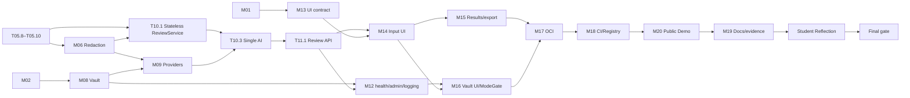

# ReviewLens Release Scope Implementation Plan

> **For agentic workers:** REQUIRED SUB-SKILL: Use `superpowers:subagent-driven-development`. Each active task needs a fresh implementation subagent, RED → GREEN → REFACTOR, then fresh spec-compliance and code-quality reviews before its real commit.

**Goal:** 在 72 小时发布窗口内交付可审查、可测试、可容器分发且有公开 Demo 的无状态 ReviewLens v1。

**Architecture:** ReviewService 在请求内完成 Diff 处理、固定规则、脱敏与单次 AI augmentation，返回 `ReportView`，不保存报告或 Diff。private 模式仅额外提供 loopback Vault；demo 模式仅用无网络 Mock 且不注册 private routes。

**Tech Stack:** Python 3.12 / FastAPI / Pydantic / cryptography / OpenAI SDK / pytest；React / TypeScript / Vite / MUI / native fetch / Vitest；单一 linux/amd64 OCI image；GitHub Actions、NJU GitLab CI。

## Global Constraints

- 规则固定为 GEN-001…005、JS-001…006；JS-007 永久取消，不得引入 tokenizer、AST、TypeScript Compiler 或解析依赖。
- 不使用 SQLAlchemy、Alembic、SQLite、Report Repository、AIReviewAttempt、历史 API、retry、Compose 或独立 admin port。
- private 整个 app 只经宿主机 loopback 暴露；demo 不注册 Vault/private routes；Vault 文件持久化不受报告无状态化影响。
- `T10.1` 必须依赖 T05.8–T05.10 **和 M06**；任何正式 ReportView 都不得绕过 `FindingRedactor`。
- 63h 是 aggregate effort estimate，不是 wall-clock buffer。最多三条合法并行线；至少锁定 8–10h 给 Reflection、最终 CI、部署复核、secret scan、clean tree 与提交，不得侵占。
- 真实 OpenAI、推送远程、Registry 发布和公开部署均须用户另行授权；CI 和 Demo 只用 Mock。

## 正式任务账本

当前正式 v1 任务总数为 **62**：已完成 52，待执行 P0 为 10，P1 为 0。T05.7 是 `CANCELLED / REMOVED BY APPROVED SCOPE REVISION`，不是正式能力也不计完成。

### 已完成任务（历史不重写）

| Task | 真实主提交 |
| --- | --- |
| T01.1 | `c3e640bd44b42cec1751d3a19c9722f1040e092d` |
| T01.2 | `e088f9b` |
| T01.3 | `3d028f4` |
| T01.4 | `49956e5` |
| T02.1 | `9d13a90` |
| T02.2 | `4aee17c` |
| T02.3 | `54409db` |
| T02.4 | `026cf5c` |
| T03.1 | `b86e296` |
| T03.2 | `fdaa593` |
| T03.3 | `4808448` |
| T03.4 | `cc3055f` |
| T03.5 | `bd8421c` |
| T03.6 | `f485f8c` |
| T03.7 | `434d826` |
| T03.8 | `63f7296` |
| T03.9 | `0428aea` |
| T04.1 | `bc1c055` |
| T04.2 | `cb3bc4d` |
| T04.3 | `aca3d57` |
| T04.4 | `4e612c4` |
| T04.5 | `12cf519` |
| T04.6 | `039f421` |
| T04.7 | `079d018` |
| T05.1 | `918cb8a` |
| T05.2 | `20a1205` |
| T05.3 | `99657fd` |
| T05.4 | `0d8adb7` |
| T05.5 | `f9cc688` |
| T05.6 | `9cdd99c` |
| T05.8 | `9a79c26` |
| T05.9 | `e181734` |
| T05.10 | `8b367ce` |
| T06.1 | `c7e60fa` |
| T06.2 | `e5ce79d` |
| T06.3 | `0b3104e` |
| T10.1 | `1c42aad` |
| T08.1 | `3d53fb4` |
| T08.3 | `fbbf029` |
| T08.4 | `53183da` |
| T13.1 | `2bae0ea` |
| T13.6 | `ae1a358` |
| T09.1 | `bc56af4` |
| T09.2 | `6059a87` |
| T09.3 | `45bf113` |
| T10.3 | `8c96adf` |
| T10.3 retrospective Provider-boundary repair | `f3d9b64` |
| T11.1 | `13b6b0a` |
| T12.1 | `040155b` |
| T12.3 | `9d6c0df`, security repair `430e6fa` |
| T12.5 | `eb4222b` |
| T14.1 | `27f1a61` |
| T15.1 | `52bef4f` |

这些提交、RED/GREEN 与双评审的真实证据保留在 `AGENT_LOG.md`、`SPEC_PROCESS.md` 和 Git 历史中。

### 已批准移除的旧任务

`T05.7, T07.1–T07.4, T10.2, T10.4, T10.5, T11.2–T11.5, T12.4, T15.2, T16.1–T16.5, T17.4, T17.5, T17.7`。

它们对应 JS-007、报告数据库/历史/retry/server export/filter、应用内限流、历史 UI、Compose 和重复 fresh smoke；不得标记完成或以替代名称恢复。

## 依赖与并行边界

首批仅允许三条 lane：

1. **Lane A:** T05.8 → T05.9 → T05.10 → T06.1 → T06.2 → T06.3。
2. **Lane B:** T08.1 → T08.3 → T08.4；M06 稳定后才进入 M09。
3. **Lane C:** T13.1 → T13.6；不得提前依赖审查 API。

## 待执行 P0 任务

每一行都是一个正式、独立、可审查任务；未出现的旧编号已在上节明确移除。所有 Python 命令必须使用 `py -3.12 -m pytest`。

| Task | 文件与唯一职责 | RED / GREEN 验收 |
| --- | --- | --- |
| T05.8 | `apps/api/tests/rules/test_javascript_rules.py`；补不支持语言、context、deleted line 不触发 JS 规则。 | `py -3.12 -m pytest tests/rules/test_javascript_rules.py::test_js_rules_do_not_apply_to_python -q` 先失败后 1 passed。 |
| T05.9 | `app/rules/dedupe.py`、`tests/rules/test_dedupe.py`；稳定去重键。 | `...test_same_added_statement_is_counted_once -q` 先失败后 1 passed。 |
| T05.10 | `app/rules/risk.py`、`tests/rules/test_risk.py`；固定聚合与稳定排序，AI 不计入。 | `...test_three_deduplicated_medium_findings_escalate_to_high -q` 先失败后 1 passed。 |
| T06.1 | `app/reviews/redaction.py`、`tests/reviews/test_finding_redaction.py`；GEN-001 不可逆替换。 | `...test_gen_001_never_retains_secret_or_tail -q` 先失败后 1 passed。 |
| T06.2 | `app/reviews/schemas.py`、`tests/reviews/test_redacted_schema.py`；SanitizedFinding 拒绝 raw 字段。 | `...test_sanitized_finding_has_no_raw_secret_field -q` 先失败后 1 passed。 |
| T06.3 | 同上；Provider payload 和 AI Finding 的二次脱敏。 | `...test_ai_payload_and_ai_finding_are_redacted -q` 先失败后 1 passed。 |
| T16.6 | `features/admin/VaultPage.tsx`、`ModeGate.tsx`、对应测试；private Vault 操作状态且 Demo 不呈现 private controls。 | `npm.cmd run test -- --run tests/ModeGate.test.tsx -t "does not render private controls in demo mode"` 先失败后 1 passed。 |
| T17.1 | 根 `Dockerfile`、`tests/containers/test_unified_image_contract.py`；单一 linux/amd64 image、Web/API、runtime factory。 | `docker buildx build --platform linux/amd64 --load -t reviewlens:test .` 先失败后成功；合同测试 1 passed。 |
| T17.3 | `.dockerignore`、`scripts/verify-container-start.ps1`；无 Vault/.env/真实 secret/Diff 的构建上下文，验证 demo/private 单条 docker run。 | `pwsh -File scripts/verify-container-start.ps1 -Check DockerfileExcludesSecrets` 先失败后成功。 |
| T18.1 | `Makefile`；`install/test/lint/build` 的真实后端/前端/镜像命令。 | `make -n test` 先失败后打印实际命令。 |
| T18.3 | `scripts/verify-ci-contract.ps1`、`.github/workflows/test.yml`、`.gitlab-ci.yml`；GitHub push/PR 与 GitLab `unit-test` 均运行 Mock、一键测试。 | `pwsh -File scripts/verify-ci-contract.ps1 -Provider GitLab` 先失败后成功。 |
| T18.5 | `.github/workflows/release.yml`；真实 tag 构建一个 linux/amd64 image 并发布 GHCR。 | `rg -q "linux/amd64" .github/workflows/release.yml` 先失败后成功。 |
| T18.8 | `scripts/verify-container-start.sh`、`docs/verification/fresh-environment-startup.md`；真实公开 image pull 后只做一次 clean-environment Demo/private run 取证。 | 未发布 tag 必须失败；真实 tag 成功后记录 digest、时间和命令。 |
| T19.1 | `scripts/verify-documentation.ps1`、`README.md`、`docs/reflection-evidence.md`、`AGENT_LOG.md`；真实仓库/镜像/运行/限制/过程证据。 | `pwsh -File scripts/verify-documentation.ps1 -RejectFabricatedEvidence` 先失败后成功。 |
| T20.1 | `scripts/verify-deployment-evidence.ps1`、`verify-public-demo.sh`、部署文档；平台中立授权记录和 Demo 部署合同。 | `... -RequireAuthorizationRecord` 未授权失败，获授权后可验证。 |
| T20.4 | `docs/verification/public-demo-deployment.md`、README、AGENT_LOG；真实 HTTPS Demo smoke、Mock 标识、无状态、Vault/private route 不可达。 | `bash scripts/verify-public-demo.sh --url "$REVIEWLENS_DEMO_URL"` 只在真实 URL 存在时成功。 |

## 每任务的强制流程

1. 新鲜 implementation subagent 仅写该行 RED 测试；控制器用 Python 3.12 或指定 Vitest 命令记录预期失败。
2. 同一 subagent 写最小实现，运行 GREEN、相关套件与全量受影响套件；再最小 REFACTOR 并复验。
3. 新鲜 spec reviewer 审查；再由不同新鲜 quality reviewer 审查。Critical 必须修复并 scoped re-review；Important 不得带入依赖任务。
4. 只有真实 commit 后，回填 hash 和 AGENT_LOG。禁止伪造 CI、镜像、PR/MR、URL 或部署。

## R01 最终发布门禁

1. 所有 62 个正式任务状态真实、工作树干净、secret scan 无真实 key/主密码/私有 Diff。
2. 学生本人完成 1,500–2,500 字 `REFLECTION.md`；agent 不创建、代写或补全该文件。
3. 最终 GitHub Actions 与 NJU GitLab Pipeline 均 Pass，后者实际含 `unit-test`。
4. 公开 Registry image 经 fresh pull/run 验证；README 只记录真实 image/tag/digest。
5. 截止日前实际 HTTPS Demo WebUI 可访问，显示 Mock、无状态，且 Vault/private routes 不可达。

## Release 时间纪律

现实 aggregate effort 约 63 小时；实际 elapsed 取决于上述三条 lane 及外部 CI/部署等待。最终 8–10 小时 release buffer 固定留给 Reflection、CI、部署复核、secret scan、clean tree 和提交，禁止用于补非 P0 功能。
