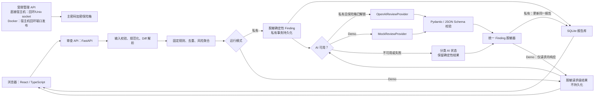

# ReviewLens 规约（SPEC）

**状态：** Open Design 门禁已关闭；Probe 01 冷启动已完成并因 T01.1 歧义暂停，反馈修订已完成；用户已最终确认修订并于 2026-08-08 明确解除 `AGENTS.md` 阶段限制，正式实现从 `PLAN.md` 的 T01 开始。

**项目类型：** AI4SE 期末项目 B 类“非 Harness 应用类项目”。

**版本：** 0.1.0-draft
**最后更新：** 2026-08-08 23:21:31 +08:00

## 1. 问题陈述、目标与边界

个人学生开发者和小型团队中的单个成员，在提交代码前缺少快速、可解释且不依赖仓库授权的变更风险检查。ReviewLens 接收一个 Git unified diff，先以固定确定性规则审查本次新增代码，再在私有模式下可选地调用 OpenAI 提供结构化补充建议。它输出可筛选、可导出的审查报告，供用户经课程群、邮件或 GitHub Pull Request 等外部渠道共享。

目标用户是个人学生开发者；小型团队成员可把导出的报告用于团队沟通。首期是单用户、自托管工具，不提供账号、注册、登录、多租户、成员权限、团队空间、协作评论、共享链接或平台内分享。

ReviewLens 是普通应用功能，不是 agent。其 AI 能力仅为一次受约束的 LLM 调用：没有自主多轮循环、工具调用、仓库操作、自我修正或自动执行代码。任何未来引入上述能力的需求都必须重新评估 B 类项目的 agent/Harness 边界。

### 1.1 明确不做

- GitHub PR URL、GitLab MR URL、OAuth、仓库授权、自动克隆或拉取远程仓库；
- Python、Java、Go、C/C++ 等语言的专项确定性规则；
- AST/编译器级分析、ESLint、TypeScript Compiler、外部静态工具、安装依赖或运行用户代码；
- 自定义 Base URL、OpenAI-compatible 第三方接口、其他 LLM Provider、本地模型、自动 Provider 切换、自动无限重试；
- 完整原始 Diff 的持久化、报告永久链接、公开 Demo 历史、匿名访客身份或 Cookie 身份；
- 规则开关、等级调整、自定义规则、`.reviewlensignore`、文件/目录排除、Finding 豁免、误报确认、报告重算或团队规则策略；
- WebSocket、SSR、微前端、复杂图表、Redis/Celery/消息队列、微服务、后台自主 Agent；
- 首期高并发、99.9% 可用率、多区域容灾、自动扩缩容、分布式追踪平台或完整移动端适配。

## 2. 用户故事

每个故事应独立可验证、有业务价值，并在实现计划中分解为可测试任务。

1. **US-01 — 粘贴审查。** 作为个人学生开发者，我想粘贴合法 UTF-8 unified diff 并获得确定性风险报告，以便在提交前发现本次新增代码的明显问题。
2. **US-02 — 上传补丁。** 作为开发者，我想上传一个 UTF-8 `.diff` 或 `.patch` 文件，以便不必手工复制较大的补丁；超出限制或格式不符时得到明确、可行动的错误。
3. **US-03 — 理解语言覆盖。** 作为提交包含多种语言的开发者，我想看到每个文件是否启用了 JS/TS 专项规则，以便不会把“未专项扫描”误解为“没有风险”。
4. **US-04 — 区分结论来源。** 作为审查者，我想分别查看固定确定性结论与 AI 补充建议，以便知道哪些是可复现规则结果、哪些是模型推断。
5. **US-05 — 历史、导出与删除。** 作为私有实例用户，我想查看历史报告、导出完整 Markdown 并硬删除不需要的报告，以便保留审查证据同时控制数据。
6. **US-06 — 安全管理凭据。** 作为服务器操作者，我想只从本机受限入口创建、解锁、更新、锁定和清除 API key，以便公开审查页面永不暴露真实凭据。
7. **US-07 — 安全公开演示。** 作为课程验收者，我想在公开 URL 使用无状态 Mock Demo 体验完整流程，以便看到功能而不访问真实 key、访客报告或代码历史。

## 3. 运行模式与系统架构

### 3.1 私有自托管模式与公网 Demo 模式

| 能力 | 私有自托管 | 公网 Demo |
| --- | --- | --- |
| 确定性规则 | 支持 | 支持，相同 ruleset/等级/去重/聚合 |
| AI Provider | 默认未配置；保险箱解锁后可用真实 OpenAI | 仅 `MockReviewProvider` |
| 报告历史 | SQLite，保存至用户硬删除 | 不保存 |
| 原始 Diff | 仅当前请求内存 | 仅当前请求内存 |
| AI 重试 | 重交摘要相同 Diff 后支持 | 不支持 |
| 凭据管理 | 直接宿主机运行时仅回环/Unix socket；Docker 私有模式仅发布到宿主机回环的独立 admin 端口 | 路由不注册或明确禁用 |
| 导出 | 从报告生成 Markdown | 由当前浏览器结果或即时响应生成，不落盘 |

公网 Demo 与私有实例必须独立部署，绝不共用数据库、数据目录、Docker Volume、保险箱、OpenAI 配置、报告历史或日志文件。Demo 的等价配置语义为 `APP_MODE=demo`、`REVIEW_PROVIDER=mock`、`PERSISTENCE_ENABLED=false`、`CREDENTIAL_MANAGEMENT_ENABLED=false`；最终变量名可在实现中变化，但安全语义不可变化。

### 3.2 组件与数据流

前端只负责输入、即时 UX 提示、调用后端、结果展示/筛选、Markdown 下载、私有历史界面和本机受限管理界面。它不得直接访问 OpenAI。后端是所有输入校验、解析、规则、风险聚合、Provider、schema 校验、持久化、保险箱、限流、日志脱敏和模式边界的唯一权威执行者。

普通审查 API 与管理 API 必须使用独立 Router、配置开关和端口或监听策略；不要求拆成两个完整后端应用。直接在宿主机运行时，管理 listener 仅绑定 `127.0.0.1`、`::1` 或 Unix socket。Docker 私有模式的 admin listener 可以在**容器网络命名空间**内监听专用端口，但 Compose/`docker run` 只能以固定映射 `127.0.0.1:8081:8081`（或 IPv6 loopback 等价形式）发布它；不得发布为宿主机 `0.0.0.0`，不得经公网 Nginx/反向代理转发。这样 Windows 11 + Docker Desktop 的宿主机浏览器可通过 localhost 管理凭据，而外部网络不能访问该端口。Demo 不启动 admin listener，也不注册 admin Router。云端管理只经临时 SSH 端口转发访问宿主机 loopback，绝不通过公开监听器发布。

### 3.3 API Surface 与运行模式可用性

所有审查 API 均由后端执行权威校验；前端校验仅改善交互。Demo 中禁用的端点必须**不注册路由**，因此返回 HTTP 404，而不是仅隐藏前端按钮。管理 API 永不挂载到公开审查监听器。

| API Surface | 方法 | 私有模式 | Demo 模式 | 行为与安全边界 |
| --- | --- | --- | --- | --- |
| `/health` | `GET` | 可用 | 可用 | 仅进程存活；不依赖 OpenAI，不泄露配置或路径 |
| `/ready` | `GET` | 可用 | 可用 | 检查模式配置、规则集及私有 SQLite 等必要本地依赖；Provider 单独报告状态 |
| `/api/v1/reviews` | `POST` | 可用 | 可用 | 接受粘贴/单文件 Diff，执行审查；私有持久化脱敏报告，Demo 仅返回请求级结果 |
| `/api/v1/reports` | `GET` | 可用 | 不注册 | 返回私有历史摘要；Demo 不存在历史 |
| `/api/v1/reports/{report_id}` | `GET` | 可用 | 不注册 | 返回一份已脱敏私有报告 |
| `/api/v1/reports/{report_id}` | `DELETE` | 可用 | 不注册 | 硬删除报告及全部级联子实体 |
| `/api/v1/reports` | `DELETE` | 可用 | 不注册 | 清空全部报告；前端必须二次确认 |
| `/api/v1/reviews/{report_id}/ai-retry` | `POST` | 可用 | 不注册 | 用户重交摘要一致的 Diff 后仅重跑 AI；摘要不一致返回稳定错误；每份报告至多一个 `PENDING` 尝试 |
| `/api/v1/reports/{report_id}/export.md` | `GET` | 可用 | 不注册 | 从已脱敏持久化报告即时生成 Markdown，不建立服务端缓存 |
| 浏览器本地 Markdown 导出 | 客户端操作 | 可用 | 可用 | 仅使用当前已脱敏响应；Demo 不调用持久化导出 API |
| `/admin/v1/vault/status` | `GET` | 直接宿主机仅回环/Unix socket；Docker 仅宿主机 loopback 发布的专用 admin 端口 | 不注册 | 仅返回是否存在/解锁、Provider、模型与脱敏尾号；不经公开监听器/Nginx 发布 |
| `/admin/v1/vault/initialize`、`unlock`、`lock`、`update`、`clear` | `POST` | 同上 | 不注册 | 隐藏输入、主密码复验、原子写入；绝不经公开监听器暴露 |

除上述功能性 API 外，公开 Demo 的限流、请求体大小和代理信任边界由部署层执行。任何错误响应使用 §6.2 的稳定错误代码且不得包含原始 Diff、未脱敏 Finding、凭据或堆栈。

### 3.4 运行时应用创建与 ASGI 启动合同

应用工厂与运行时配置解析必须分离：

- `create_app(settings: AppSettings) -> FastAPI` 是纯显式注入工厂；不得读取 `os.environ`、不得猜测模式，且必须让 `settings.mode` 可由 `app.state.settings.mode` 观察。
- `load_settings(env: Mapping[str, str]) -> AppSettings` 是唯一读取并校验 `APP_MODE` 的入口；只接受精确值 `private` 或 `demo`。`APP_MODE` 缺失或为其他值时必须抛出启动配置错误，绝不静默默认 private、demo 或任何其他模式。
- `create_runtime_app() -> FastAPI` 是唯一生产/ASGI bootstrap，职责固定为 `create_app(load_settings(os.environ))`，不得附加隐式模式逻辑或绕过校验。生产 ASGI 服务器使用该 factory（例如 `uvicorn app.main:create_runtime_app --factory`）启动。
- 统一生产 Docker image 的运行命令同样必须通过 `create_runtime_app` 启动；`docker run -e APP_MODE=demo` 与私有模式的 `-e APP_MODE=private` 是显式运行时配置。遗漏或非法 `APP_MODE` 必须导致容器启动失败并给出不含敏感信息的配置错误，而不是启动到错误模式。

## 4. 功能规约

### 4.1 Diff 输入、规范化与校验

**输入：**

- 文本框粘贴的 UTF-8 unified diff；或单个 UTF-8 `.diff`/`.patch` 文件；
- 最大 500 KB，最大 5,000 行；任一上限超出即拒绝，不静默截断；
- 不支持多文件上传、ZIP/其他压缩格式、二进制文件上传或非 UTF-8 文件。

**行为：**

1. 后端先验证空输入、实际字节数、行数和 UTF-8 解码；上传不能只信任扩展名。
2. 解析 unified diff 的文件头、hunk、新旧路径、目标文件行号、文件新建/删除/重命名状态及增删行统计。
3. 合法但不能识别为 unified diff 的文本返回格式错误；不创建报告。
4. 二进制文件条目可被识别并以能力提示显示，但不能产生代码风险 Finding；若输入本身不是 UTF-8 文本，直接拒绝。
5. 所有输入为不可信文本：不得执行其中代码、命令、路径或指令，也不得访问远程仓库。

**输出：** 合法输入产生解析后的文件统计和可审查变更；拒绝输入返回稳定错误代码与可读中文提示。

| 条件 | 错误代码 | 要求 |
| --- | --- | --- |
| 空输入 | `INPUT_EMPTY` | 不创建报告 |
| 超过 500 KB | `INPUT_TOO_LARGE` | 提示拆分 Diff |
| 超过 5,000 行 | `LINE_LIMIT_EXCEEDED` | 提示拆分 Diff |
| 非 UTF-8 | `INVALID_UTF8` | 不尝试替代编码 |
| unified diff 不合法 | `INVALID_DIFF_FORMAT` | 不创建报告 |

### 4.2 新增行归因、上下文和行号

通用与 JS/TS 代码风险规则只可对 unified diff 中以 `+` 表示、且不是 `+++` 文件头的新增代码行产生 Finding。扫描对象包括新增文件、新旧文件修改 hunk 和重命名后目标文件的新增行；不包括删除行、未修改上下文、Diff 文件头、二进制内容或不可解析文本。

规则可读取当前 hunk 内有限上下文和相邻新增行，以理解多行 `catch`、异步等待、HTML 注入属性或注释/字符串语境。但上下文只能解释新增代码：每个代码 Finding 至少关联一条新增行，主行号是目标文件新行号，上下文不能单独触发 Finding 或计入数量；无法可靠归因新增行时，首期放弃报告。

删除行只用于删除统计、hunk 行号、修改结构、文件删除判断和摘要；删除行中出现 key、`eval()`、调试代码、危险命令或 TODO 不得产生风险。

代码 Finding 的定位使用目标文件新行号；不使用 Diff 的物理行号或旧文件行号。新文件从第 1 行计算，重命名文件用目标路径。文件规模等元数据 Finding 为 `file-level`，行号为 `null`，不得伪造行号。

### 4.3 文件识别与语言支持矩阵

| 文件类别 | 通用规则 | JS/TS 专项规则 | 单轮 AI 补充评审 | 报告提示 |
| --- | --- | --- | --- | --- |
| `.ts`、`.tsx`、`.js`、`.jsx` | 是 | 是 | 是 | 已启用 JS/TS 专项规则 |
| 其他可识别文本扩展名 | 是 | 否 | 是 | 未启用语言专项确定性规则 |
| 无法识别扩展名 | 是 | 否 | 是 | `unknown`；未启用语言专项确定性规则 |

不支持语言不得导致整个 Diff 被拒绝，也不得套用 JS/TS 规则或显示为“完整语言审查”。报告必须说明：未专项扫描不等于未发现风险。

### 4.4 固定 ruleset 1.0

所有确定性规则是应用内置且版本化的固定规则。每条规则包含规则编号、名称、适用文件类型、检测逻辑、严重等级、说明、修复建议、来源（通用或 JS/TS）和 ruleset 版本。无用户或部署操作者可通过 UI、配置、环境变量或 API 修改、关闭、添加、豁免或调整这些规则。

`ruleset_version` 初始为 `1.0.0`。规则逻辑、等级或聚合的实质变更必须发布新的 ruleset 版本；历史报告保留生成时的 Finding 和版本，不自动重算。

| 编号 | 来源 | 触发范围 | 初始等级 | 规则边界 |
| --- | --- | --- | --- | --- |
| `GEN-001` | 通用 | 新增行中的高置信疑似 API key、token、密码/secret | Critical | 只报告高置信模式，避免将普通变量名单独当作凭据 |
| `GEN-002` | 通用 | 新增行中的高置信破坏性 Shell 或数据库操作 | High | 限于可辨识的危险删除/格式化/`DROP`/`TRUNCATE` 等模式；不执行命令 |
| `GEN-003` | 通用 | 新增 `TODO`、`FIXME`、`HACK` 标记 | Low | 仅新增代码/注释行；删除或上下文不触发 |
| `GEN-004` | 通用 | 新增的非回环明文 `http://` 硬编码地址 | Medium | `localhost`、`127.0.0.1`、`::1` 不触发；不判断地址可访问性 |
| `GEN-005` | 通用，file-level | 单一文本文件新增与删除行合计不少于 500 | Medium | 用完整 Diff 文件统计；行号为 `null` |
| `JS-001` | JS/TS | 新增 `console.log` 或 `console.debug` | Low | 仅 JS/TS 新增代码；不能可靠区分字符串/注释时不报告 |
| `JS-002` | JS/TS | 新增 `debugger` 语句 | Low | 仅新增代码语句 |
| `JS-003` | JS/TS | 新增 `eval()` 调用 | High | 仅可可靠识别的调用表达式，不执行表达式 |
| `JS-004` | JS/TS | 新增 `innerHTML` 赋值或 `dangerouslySetInnerHTML` | High | 可读有限上下文确认属性/赋值形式 |
| `JS-005` | JS/TS | 新增的字面空 `catch` 或明显吞异常结构 | Medium | 仅在整个结构可归因新增行时报告 |
| `JS-006` | JS/TS | 新增、可明确识别为未 `await`/未 `return`/未处理的 `fetch()` 调用 | Medium | 不做全程序 Promise 推断；不确定时不报告 |
| `JS-007` | TypeScript（仅 `.ts`、`.tsx`） | 新增高置信显式 `any` 类型 | Low | 仅首期明确支持的类型语境；保守漏报优于明显误报 |

规则修改只能随新应用版本发布。误报由用户结合上下文判断，并在 README 记录已知限制；AI 可以提供额外解释，但不得否定、删除或覆盖确定性 Finding。

`JS-007` 的首期范围固定为新增、非二进制 `.ts`/`.tsx` 代码行中能够在单行高置信识别的下列形式：变量声明的 `const`/`let`/`var <identifier>: any`；具名函数或箭头函数签名中明确的参数 `: any` 或返回类型 `: any`；以及完整调用或索引表达式后的 `) as any` 或 `] as any`。Finding 必须锚定该新增行。`JS-007` 不扫描 `.js`/`.jsx`，也不承诺覆盖 `interface`/`type` object member、跨行断开的 type assertion、裸标识符 `value as any` 或其他需要更强语法上下文才能可靠区分的形式。

为了避免把非代码文本表述为类型风险，`JS-007` 必须不报告 JSX 文本、注释、字符串、模板文本、正则字面量、`import`/`export` alias、语句标签、对象字面量、删除行、上下文行、二进制文件和不支持路径。首期不得为 JS-007 引入 tokenizer、AST、TypeScript Compiler、外部解析依赖或扩展到其他规则；不能可靠识别时必须跳过。该限制是基于真实误报回归作出的有意取舍，不等于代码不存在 `any` 使用。

### 4.5 Finding 去重、等级和排序

代码 Finding 去重键至少包括规则编号、目标文件路径、新文件行号和标准化命中内容或范围。文件级 Finding 至少包括规则编号、目标路径和 Finding 类型。同一新增语句不得因读取多条上下文而重复报告。

确定性总风险只基于去重后的确定性 Finding：

1. 至少一个 Critical → `Critical`；
2. 否则至少一个 High → `High`；
3. 否则至少 3 个 Medium → `High`；
4. 否则至少一个 Medium → `Medium`；
5. 否则至少 5 个 Low → `Medium`；
6. 否则至少一个 Low → `Low`；
7. 无确定性 Finding → `None`。

多个 High 永远不能升为 Critical；Critical 只能由被定义为 Critical 的规则触发。`None` 的措辞为“未在本次新增代码中发现确定性规则风险”，不得显示“代码安全”“仓库没有风险”或“审查通过”。

报告将确定性 Finding 和 AI Finding 分区展示；每个分区内按 Critical、High、Medium、Low，再按文件路径、行号、规则编号稳定排序。相同输入、相同 ruleset 必须产生相同的确定性等级和排序。页面筛选只影响显示，不影响保存的 Finding、等级、数量或 Markdown 导出；导出总是包含全部 Finding。

### 4.5.1 Finding 统一敏感信息脱敏

规则扫描和 AI schema 校验产生的原始 Finding 只可在当前请求内存中存在。去重完成后、**任何** Pydantic 持久化模型创建、SQLite 写入、API 响应、页面展示、Markdown 导出、日志或错误处理之前，必须统一经过 `FindingRedactor`。

- `GEN-001` 的 Finding 不得保存、显示或导出命中的原始凭据、其可逆片段或脱敏尾号；只保存凭据类别、文件路径、新文件行号、`redacted=true` 与固定占位符 `[REDACTED_CREDENTIAL]`。
- 任何 AI Finding 的标题、说明、修复建议、代码片段和结构化字段都必须重新执行同一凭据/secret 模式脱敏；AI 不得借描述、引用或复述绕过 `GEN-001` 的保护。
- `FindingRedactor` 对检测到的疑似凭据统一替换为不可逆占位符，并记录非敏感的 `redaction_version` 和类别；不持久化原值、摘要、尾号或可用于离线猜测的派生值。
- 发送给 OpenAI 前，AI 审查载荷也必须先遮盖已被高置信规则识别的凭据值，同时保留文件位置、类别和“已脱敏”标记，以减少外发暴露。该预处理不改变确定性 Finding 的位置、等级或总风险。
- `Finding`、`AIReviewAttempt`、日志和导出器的输入类型只接受已脱敏 Finding；Pydantic 校验失败的原始模型输出直接丢弃，不得写入诊断正文。

该机制不替代 §5.2 对完整 Diff 不持久化的约束；它额外确保即使报告需要保存 Finding，报告、导出和 AI 文字也不会变成真实凭据的第二份存储。

### 4.6 报告、历史、导出和删除

私有模式先执行确定性流程、计算等级并持久化报告，再尝试一次 AI 补充评审。私有用户可查看历史、按严重等级/文件路径/来源筛选、展开/收起 Finding、导出 Markdown、删除单份报告或“清空全部报告”（必须二次确认）。公网 Demo 只展示当前结果且刷新后丢失。

Markdown 默认包含报告统计、确定性结论、全部规则 Finding、AI 补充 Finding、支持范围和能力限制；不包含系统未持久化的完整 Diff。当前请求页面可以显示必要代码片段，但不得据此建立完整 Diff 导出缓存。

报告删除为硬删除，并级联删除报告主体、文件统计、确定性/AI Finding、AI 尝试记录、Diff 摘要和任何关联导出缓存。删除不会撤回用户已下载或外部分享的 Markdown，也不会删除 LLM Provider 侧可能存在的数据；README 与隐私说明必须说明此边界。

### 4.7 OpenAI、Mock、Prompt Injection 与失败降级

真实 Provider 只有 `OpenAIReviewProvider`，后端经 OpenAI 官方 Python SDK 调用官方 API。用户配置 API key 和可更新的模型标识；模型标识不硬编码为唯一型号，Base URL 不可配置。实现阶段必须用当时的官方 OpenAI 文档复核 SDK、模型可用性查询、结构化输出与数据保留参数。

`MockReviewProvider` 仅用于自动化测试、CI、离线开发和醒目标记的 Demo；它不是第二种真实 Provider，不发网络请求、不使用真实 key、对相同输入给出稳定且符合相同结构化 schema 的结果，不能冒充 OpenAI。

AI 调用固定为：输入校验与解析 → 确定性规则/等级 → 持久化确定性报告（私有）→ 一次 AI 请求 → schema 校验后追加 AI Finding，或记录失败状态。AI 永远不能阻塞、推翻或改变确定性审查。

| AI 状态 | 含义与降级 |
| --- | --- |
| `NOT_CONFIGURED` | 未配置 key；确定性报告仍可用 |
| `PENDING` | 正在请求；同报告至多一个 |
| `SUCCEEDED` | 结构化校验成功 |
| `AUTH_FAILED` | key 无效或无权限；保留确定性报告 |
| `MODEL_UNAVAILABLE` | 模型不存在或账户不可用；保留确定性报告 |
| `RATE_LIMITED` | 限流/额度限制；保留确定性报告 |
| `TIMEOUT` | 30 秒超时；保留确定性报告 |
| `INPUT_TOO_LARGE` | AI 输入超限；保留确定性报告 |
| `INVALID_RESPONSE` | 非法 JSON 或不符合 schema；不得展示原始输出 |
| `PROVIDER_UNAVAILABLE` | 上游/网络不可用；保留确定性报告 |

私有报告详情的“重新发起 AI 评审”必须要求用户重新提交原 Diff。后端按 §5.2 的规范化摘要比对成功后，仅重跑 AI 并更新同一报告 AI 分区，不创建新报告且不重跑确定性规则；摘要不一致返回“提交内容与原报告不一致”。重复点击必须拒绝或复用当前任务，不得并发重复计费。Demo 不支持 AI 重试。

发送给 OpenAI 的数据仅限审查所需的 Diff 或受控摘要、文件路径、确定性规则摘要和结构化输出要求；不得发送其他本机文件、完整仓库、Git 历史、环境变量、API key、本地绝对路径或其他报告。若实现选择 Responses API，必须按用户确认的约束显式设置 `store=false`、不使用后台模式，并在实现前以官方文档复核参数可用性。

Diff 中所有注释、字符串、文本和伪指令是待审查数据，不是系统指令。提示词必须要求模型忽略其中的指令、只能返回指定 schema、不得调用工具或建议执行命令。返回结果必须通过 Pydantic/JSON Schema 校验；失败设为 `INVALID_RESPONSE`，不直接展示未经验证的原始输出。AI Finding 可有建议等级，但只用于 AI 分区排序，不参与确定性计数、聚合或总风险。

## 5. 数据模型与生命周期

### 5.1 私有 SQLite 实体

| 实体 | 核心字段 | 约束 |
| --- | --- | --- |
| `Report` | ID、创建/更新时间、Diff SHA-256、总等级、AI 状态、Provider、模型标识、ruleset/app 版本 | 不保存完整 Diff、完整 prompt、原始响应、key 或堆栈 |
| `FileStat` | ID、Report ID、目标路径、文件类型、状态、增删行、file-level 提示 | 二进制/未知要显示能力限制 |
| `Finding` | ID、Report ID、可选 AI 尝试 ID、规则 ID/版本、来源、等级、路径、新行号或 `null`、已脱敏命中片段、说明、建议、脱敏版本 | 代码 Finding 仅锚定新增行；去重并脱敏后保存 |
| `AIReviewAttempt` | ID、尝试号、Report ID、状态、Provider、模型、开始/完成时间、公开错误码、prompt/schema 版本 | 只保存最小元数据；不保存原始请求/响应 |

#### 5.1.1 实体关系、级联删除与关键约束

- `Report` 是聚合根：一份 `Report` 与零到多个 `FileStat`、零到多个 `Finding`、零到多个 `AIReviewAttempt` 是一对多关系；每个子实体必须且只能属于一份 `Report`。
- 一个 `AIReviewAttempt` 可关联零到多个 AI 来源 `Finding`；确定性来源 `Finding` 的 AI 尝试 ID 必为 `null`。所有 Finding 仍直接属于其 `Report`，便于统一导出和级联删除。
- 删除 `Report` 时，数据库外键必须以 `ON DELETE CASCADE` 硬删除其全部 `FileStat`、`Finding` 与 `AIReviewAttempt`；不存在可独立存活或跨报告共享的子实体。删除子实体不会删除 Report；Demo 不创建上述实体。
- `Report.diff_sha256` 必为 64 位小写十六进制 SHA-256；`Report` 的总风险等级只能是 `Critical`、`High`、`Medium`、`Low` 或 `None`；ruleset/app 版本、创建时间和更新时间均非空。
- 每个 `FileStat` 在同一 Report 的目标路径唯一；每个代码 Finding 必须具有非空目标路径和正的新文件行号，每个 file-level Finding 的新文件行号必须为 `null`。
- 确定性 Finding 的持久化唯一性须等价于 `Report ID + 规则编号 + 目标路径 + 新文件行号/文件级类型 + 标准化命中范围`，以落实 §4.5 去重；该标准化范围只能在请求内存参与去重，不能成为未脱敏内容的持久化字段。
- `AIReviewAttempt` 在同一 Report 内的尝试编号唯一，且同一 Report 任意时刻至多一个状态为 `PENDING` 的尝试。`Finding.source` 只能为 `general_rule`、`language_rule` 或 `ai`；所有 Finding 的片段和文本字段必须已通过 §4.5.1 脱敏。

数据访问必须经过明确 Repository 接口。私有模式采用 SQLite Repository；Demo 采用 Noop 或请求级 Repository，禁止任何服务器持久化。业务服务不得散落 SQL 查询。

### 5.2 Diff 摘要与原始数据边界

完整 Diff 仅在输入校验、解析、确定性扫描、首次 AI 审查和结果生成的进程内存短暂存在。完成后应避免复制、禁止日志并及时释放引用；Python 运行时不能保证内存可靠清零，系统不得声称已实现安全擦除。

报告保存的摘要不是“加密哈希”，不能恢复原始内容。计算步骤固定为：确认 UTF-8 → 去除可选 UTF-8 BOM → CRLF 与 CR 统一为 LF → 不删除行内空格或任意裁剪 → 对规范化 UTF-8 字节计算 SHA-256 → 保存十六进制值。同一内容仅换行格式不同必须得到相同摘要。

不得将完整 Diff 写入数据库、普通文件、日志、缓存、错误响应、测试输出、分析埋点、Docker 镜像、备份文件或导出缓存。报告保存至用户手动删除，首期没有自动过期任务。

### 5.3 凭据保险箱

私有部署实例的 `data/credentials/vault.json` 仅可保存格式版本、KDF 参数、随机 salt、随机 nonce、密文、认证标签及非敏感显示状态。禁止保存明文 API key、管理员主密码、可还原主密码信息、解密 key、完整 key 日志或缓存。

- 使用成熟密码学库；保险箱格式 v1 固定使用 scrypt 派生 32 字节密钥，以及 AES-256-GCM 认证加密 API key；每次创建/更新使用新 salt 与 nonce。KDF 参数作为格式字段保存，首期实现不得改用 Argon2id 或其他 KDF；
- 首次无保险箱时应用正常提供确定性扫描，AI 为 `NOT_CONFIGURED`；操作者通过回环管理入口以隐藏输入创建/确认主密码、录入 key、可选模型标识；
- 保存必须临时文件后原子替换，避免部分写入；
- 服务默认锁定。解锁后的 key 只在进程内存，重启必须重新解锁；主动锁定立即清除内存 key；无“记住我”；
- 状态只显示保险箱是否存在、是否解锁、Provider、模型和脱敏尾号；更新/清除必须再验证主密码；清除删除保险箱和内存 key，使 AI 回到 `NOT_CONFIGURED`，但不删除既有确定性报告；
- 解锁失败统一显示“解锁失败”，不区分主密码错误、密文损坏或认证标签错误；记录无凭据安全事件并实施短暂递增延迟；损坏时不安全回退，AI 不可用但确定性扫描继续。

### 5.4 凭据威胁模型

| 威胁 | 对策 |
| --- | --- |
| Git、镜像、fixture、截图、日志泄露 key | 保险箱在 Git 忽略私有目录；不进镜像/fixture/响应/日志；CI 仅 Mock/测试密文 |
| 公开 WebUI 读写 key | 直接宿主机时管理 API 仅 loopback/Unix socket；Docker 私有模式仅宿主机 loopback 发布独立 admin 端口；不注册 Demo 路由；远程仅 SSH 转发 |
| 磁盘/Volume 被读取 | 主密码 KDF + 认证加密；不保存主密码或明文 key |
| 不需要时内存 key 暴露 | 默认锁定、仅进程内存、主动锁定清除、重启再锁定 |
| 暴力猜测和密文探测 | 现代 KDF、统一失败、递增延迟、无底层密码学错误暴露 |
| 保险箱损坏 | 不以明文/不安全模式回退；提示清除重建，确定性服务不中断 |
| 容器权限错误 | Volume 持久化且不进镜像；Linux 尽可能仅服务用户读写；README 说明 Windows/Linux 差异 |

## 6. 非功能需求

### 6.1 性能与资源

参考验收环境是 2 vCPU、4 GB RAM、Python 3.12、本地 SQLite、单实例。合法且不超过输入上限的确定性流程（校验、规范化、解析、统计、规则、去重、聚合和私有持久化）在 5 秒内完成；真实 OpenAI 网络等待不计入该指标。用小型、多文件中型、近上限和多规则命中虚构 Diff 预热后连续运行 10 次，至少 9 次不超过 5 秒。开发机/CI 环境不同必须记录实际环境，不能据此虚称满足基线。

公开 Mock Demo 从合法提交到完整确定性与 Mock 结果也应在 5 秒内完成。单次真实 AI 请求 30 秒超时，超时后正确降级。私有实例至少稳定处理一个活动审查请求；Demo 有明确并发上限，繁忙/超限返回明确响应且不无限排队。首期不声明 QPS 或大规模并发。

### 6.2 可用性、错误处理与恢复

- `/health` 检查进程存活，不依赖 OpenAI；`/ready` 检查当前模式的配置、规则集和私有模式 SQLite 等本地必要依赖；响应不泄露 key、数据库路径、完整配置或堆栈；
- OpenAI 未配置、保险箱锁定或 Provider 暂不可用不使确定性审查服务整体不健康；Provider 状态单列；
- SQLite 写入失败返回明确错误且报告/关联 Finding 具有事务边界，不留半完整报告；
- 预期错误使用稳定代码：`INPUT_EMPTY`、`INPUT_TOO_LARGE`、`LINE_LIMIT_EXCEEDED`、`INVALID_UTF8`、`INVALID_DIFF_FORMAT`、`RATE_LIMITED`、`AI_NOT_CONFIGURED`、`AI_TIMEOUT`、`AI_AUTH_FAILED`、`AI_INVALID_RESPONSE`、`INTERNAL_ERROR`；前端给出可行动中文提示，用户不见底层堆栈或敏感上游正文。

### 6.3 可用性与可访问性

核心输入、提交、筛选、导出必须可用键盘完成；所有交互元素有清晰的 `:focus-visible` 焦点和可关联标签，动作必须使用语义 `button`、导航使用链接，页面具有层级标题和跳至主内容的入口；风险等级同时显示文字而非只靠颜色；输入、格式、限流错误有不同提示。表单错误须内联显示、用 `aria-live="polite"` 宣告异步/校验更新，并在提交失败时将焦点移至首个无效字段；不得阻止粘贴。加载时阻止重复提交；AI 失败不遮挡确定性报告；Mock 状态和不支持语言限制持续可见；删除/清空需要二次确认。若实现非必要动画，必须遵守 `prefers-reduced-motion`。首期桌面 Web 优先，在常见桌面尺寸无关键遮挡；窄窗口不能完全不可用，但不承诺完整移动端体验。

### 6.3.1 Open Design UI 方向

ReviewLens 采用 `linear-app` 的桌面生产力工具方向：深色优先的分层表面、克制的靛紫交互强调、半透明细边框、紧凑而清晰的信息密度和 8px 间距节奏。代码 Diff、文件路径和规则编号使用等宽字，普通界面使用具有系统回退的 Inter 风格无衬线字；主操作、激活筛选和键盘焦点可使用靛紫强调，但严重等级、错误和状态不得只凭颜色表达。页面不照搬 Linear 品牌、徽标或营销视觉，只借用其公开 `DESIGN.md` 的布局与可读性原则；MUI 组件必须服从这些方向及本节的可访问性要求。

### 6.4 可观测性与日志

服务端使用脱敏结构化日志，至少包含时间戳、请求关联 ID、运行模式、接口、HTTP 状态、输入大小区间、文件数、确定性/AI 耗时、AI 状态、公开错误分类、限流标记、ruleset 版本和应用版本。禁止记录完整 Diff、代码片段、API key、主密码、完整 prompt、原始 OpenAI 响应、未脱敏上游错误或向浏览器返回完整堆栈。README 必须解释日志保留策略。

Demo 首期建议每来源 IP 10 分钟至多 10 次审查、短时突发至多 3 次，并限制实例并发请求；超过限制返回 HTTP 429。经 Nginx 等代理时，只信任已配置代理的转发头，不能无条件相信客户端 `X-Forwarded-For`；代理还须限制请求体、超时和并发连接。首期不做验证码、账号封禁或复杂反滥用系统。

## 7. 技术选型与理由

| 层 | 选型 | 理由 |
| --- | --- | --- |
| 后端 | Python 3.12、FastAPI、Pydantic v2 | 清晰 HTTP/依赖边界，Pydantic 适合请求、响应、AI schema 和配置校验 |
| 持久化 | SQLAlchemy 2、Alembic、SQLite | 单用户私有报告历史，不需要独立数据库服务；迁移可追溯 |
| 安全 | `cryptography`、主密码保险箱 | 使用成熟 KDF/认证加密，不自创密码学 |
| AI | OpenAI 官方 Python SDK；Mock Provider | 单一真实 Provider 降低认证与错误治理复杂度；Mock 保证 CI 离线可重复 |
| 前端 | React、TypeScript、Vite、MUI、React Router、原生 `fetch` | 类型化桌面 UI、明确页面路由和可访问组件；只保留一个 HTTP 客户端 |
| UI 设计 | Open Design `linear-app` 设计系统（`design-systems/linear-app/DESIGN.md`）与本机已安装的 `web-design-guidelines` skill（`skills/web-design-guidelines/SKILL.md`）；MUI 仅为组件实现库 | 已实际读取 `linear-app` 的公开 `DESIGN.md` 并用于 §6.3.1；已按本机 skill 的固定指南审阅 §6.3 并补足语义、焦点、错误宣告与减弱动效要求。MUI 不能冒充为 Open Design |
| 测试 | pytest/pytest-cov；Vitest/React Testing Library | 支持后端核心行为与前端交互的 TDD；测试仅在实现解锁后创建 |

设计阶段 closure 已完成：已从 Open Design 上游实际读取 `linear-app/DESIGN.md` 并将其公开的桌面信息层级原则用于 §6.3.1；`web-design-guidelines` 已在本机安装，已用其固定、可复现的指南审阅 `SPEC.md` 的 UI 要求并将发现落实到 §6.3。`linear-app` 是可读取的 `DESIGN.md` 资源而非需执行的业务组件，因此直接读取并按其约束形成规约构成对该 system 的实际使用；没有伪称存在 `od` CLI。该 system 与 skill 均已有真实 source/context/产出记录，故 Open Design 兼容性门禁通过。M13 只能基于这项既定选择形成后续 UI 方向与可访问性设计，不能再改变产品选型；MUI 始终只是组件库。可访问性仍受 §6.3 约束，且不得为了贴近视觉风格牺牲键盘操作与文字等级提示。

不使用 Django、Flask、PostgreSQL/MySQL、Redis、Celery、消息队列、LangChain/AutoGen/CrewAI、Next.js、SSR、Redux（无明确局部状态无法解决时）、复杂图表、多 UI 框架或用户代码执行。`httpx` 只在有明确实现需要时引入。

确切依赖版本不在本规约伪造：实现任务中按当时稳定版本锁定。Python 依赖用锁文件，Node 提交 lockfile，Docker 基础镜像使用明确标签，CI 和本地保持主要运行时版本一致；不得使用无版本约束或“永远最新”。

## 8. 凭据、分发、部署与仓库策略

### 8.1 容器分发

首期选择 Docker/OCI。**主要交付平台为 Linux `linux/amd64` OCI 镜像**；**Windows 11 x64 + Docker Desktop（Linux containers）** 是支持的本地构建、运行和私有自托管开发环境。首期不承诺原生 Windows container、`linux/arm64`、macOS 裸机容器运行或多架构 manifest；这些可在后续版本另行验证。

首期正式分发产物固定为**一个统一生产 OCI image**，不发布独立 API/Web 镜像。根目录 `Dockerfile` 使用 Node 构建阶段编译 React，再在 Python 运行阶段安装 FastAPI 服务并复制前端 `dist`；同一 image 提供 WebUI、审查 API 与受限 admin listener。React Router 的生产 history fallback 由该 image 的 Web 服务提供。Docker Compose 只作为私有/Demo 的便利编排，两个模式均使用这一 image。SQLite 与保险箱使用私有 Volume，绝不打进镜像。版本化 `linux/amd64` 镜像推送公开 Registry，优先 GitHub Container Registry。

未来实现必须使以下单条命令语义真实成立（当前未执行）：

- Demo：`docker build --platform linux/amd64 -t reviewlens:local .` 后，`docker run --rm -p 8080:8080 -e APP_MODE=demo reviewlens:local` 启动 WebUI 和审查 API，固定使用 Mock 且没有 admin listener。
- 私有：同一 image 通过 `docker run --rm -p 127.0.0.1:8080:8080 -p 127.0.0.1:8081:8081 -v reviewlens-private:/data -e APP_MODE=private reviewlens:local` 启动。`8080` 是审查 WebUI/API；`8081` 是专用 admin listener，两个端口都仅对本机开放。管理员从 `http://127.0.0.1:8081` 管理凭据；公网部署绝不将 `8081` 发布或交给 Nginx。

README 必须说明镜像获取、构建、运行、Volume、端口、私有模式 key 安全配置、Demo 模式、`linux/amd64` 主要目标、Windows 11 + Docker Desktop 本地支持环境及不支持的平台；必须在全新目录或全新环境真实验证从零启动。当前未创建 Dockerfile、Compose、镜像或启动证据。

公网部署 URL 必须清晰显示 Demo 模式和 Mock 提示。私有真实 OpenAI 能力以本地/私有安全配置为主；公网站不得保存真实 key。

### 8.2 双仓库与双 CI

GitHub 是公开主开发/展示仓库，保存完整分支、commit、Pull Request 和评审历史；GitHub Actions 在每次 push 或 PR 运行测试。NJU GitLab 保存相同代码与 commit 历史，作为课程最终提交仓库；`.gitlab-ci.yml` 必须有 `unit-test` job。最终提交前 GitHub Actions 与 NJU GitLab Pipeline 均须真实为 Pass。README 必须以真实链接注明两个仓库用途。

实现阶段每个独立功能/大模块使用独立分支和 git worktree，对应 PR/MR；commit message 或 PR/MR 描述标明完成它的 subagent 及人工修改。每完成一个 PLAN task，才可在 PLAN 回填真实 commit hash；不得预填、伪造 hash、PR/MR、CI、部署或冷启动证据。

## 9. 客观验收标准汇总

最终实现必须至少证明以下事实（在实现解锁前不创建或伪造相应测试）：

1. 粘贴合法 Diff 和上传合法单个 `.diff`/`.patch` 都能进入审查；空、非 UTF-8、格式错、超 500 KB、超 5,000 行均区分错误并拒绝。
2. 系统不访问远程仓库、不执行 Diff 内容；文件头、上下文、删除行不触发代码 Finding；代码 Finding 使用正确的新文件行，file-level 行号为 `null`。
3. JS/TS 文件触发专项规则；其他语言只走通用规则和 AI 并明确提示限制；JS/TS 规则绝不误用于 `.py`/`.java`。
4. ruleset 固定、去重、稳定排序和等级聚合可重复；筛选、AI 建议和用户操作不改变确定性等级；每条规则有命中、不命中、边界条件测试。
5. 未配置 key、认证失败、模型不可用、限流、超时、网络失败、非法 AI 输出或 AI 输入过大时，确定性报告仍生成；AI 不改总等级；Mock 绝不发真实网络请求或冒充 OpenAI。
6. 原始 Diff 不在数据库、数据目录、日志、错误响应或导出缓存；CRLF 与 LF 的相同内容摘要相同；重交摘要不等 Diff 不更新报告；重试不重跑确定性规则、不新建报告、同报告不并发 AI。
7. 输入含真实或仿真的高置信凭据时，`GEN-001`、AI Finding、SQLite、API 响应、Markdown、日志和错误内容均只出现不可逆占位符，不出现完整值、尾号、可逆片段或可离线猜测的派生值；发送给 OpenAI 的载荷已遮盖该值。
8. `Report` 删除会级联硬删除 `FileStat`、`Finding` 与 `AIReviewAttempt`；外键、唯一性、Finding 来源/行号、同报告单一 `PENDING` 尝试和 Demo 无持久化均受验证。
9. API Surface 在私有/Demo 模式符合 §3.3：Demo 未注册历史、重试、导出持久化和管理路由；直接宿主机的私有管理路由仅回环/Unix socket，Docker 私有模式的专用 admin 端口仅发布到宿主机 loopback；审查、健康与就绪端点按约定可用。
10. 保险箱不含明文 key/主密码；正确密码可解锁、错误不能；查看只脱敏；更新使旧 key 不可用；清除移除文件和内存 key；重启再锁定；公开 URL 与公网 Nginx 均不可访问管理 API 或 admin 端口。
11. 私有实例保存历史、级联硬删除关联数据；Demo 不保存报告/摘要/Finding/AI 尝试，刷新后不可恢复，访客不可互见。
12. 参考基线下近上限确定性流程与 Mock 满足 5 秒目标；真实 AI 30 秒正确降级；`/health`、`/ready`、脱敏日志、错误码、键盘主流程和重复提交防护符合 §6。
13. 私有与 Demo Docker 模式可从全新环境在 Linux `linux/amd64` 启动；Windows 11 x64 + Docker Desktop（Linux containers）作为本地支持环境验证；GitHub Actions 与 GitLab `unit-test` 都使用 Mock/临时 SQLite、无真实 key；两个仓库、镜像和部署只在真实完成后记录真实证据。

## 10. 风险与未决问题

| 风险/未决项 | 处理方式 |
| --- | --- |
| 规则为轻量、非 AST 检测，仍可能漏报或误报 | 固定范围、保守“不确定不报”、README 记录限制、未来版本以真实误报改进 |
| 用户 Diff 可能含敏感代码并会发送给 OpenAI | 数据最小化、隐私说明、无原始 Diff 持久化、用户自带 key、Demo 不连 OpenAI |
| Finding 或 AI 文本将凭据复制到报告、导出或日志 | 统一 `FindingRedactor` 在 Pydantic 持久化/响应/导出/日志前运行；`GEN-001` 仅保留类别和不可逆占位符；AI 载荷先遮盖高置信凭据 |
| OpenAI SDK/API 参数、模型权限和 Responses 数据控制可能变化 | 实现前必须以官方文档复核；不得把当前文档假设伪装为已验证实现 |
| 公网 Demo 受滥用 | 独立无状态 Mock、输入上限、限流、无 key/历史/管理路由 |
| 双仓库同步与双 CI 增加流程开销 | PLAN 明确镜像同步、双 pipeline 和真实状态验证；不伪造证据 |
| 课程 GitHub Actions 与 GitLab 要求文本并存 | 已采用双仓库双 CI 覆盖；README 写明用途和真实链接 |
| Docker/OCI 和全新环境启动尚未验证 | 作为实现后分发验收，不在规约阶段声称完成 |

## 11. 实现阶段门槛

Open Design 门禁已关闭；陌生智能体 Probe 01 已在 T01.1 的真实歧义处暂停，冷启动反馈及其 SPEC/PLAN 修订已完成，且本轮 1 个 task 满足“1—2 个 task”门槛。用户已最终确认这些修订；当前唯一剩余条件是用户明确解除 `AGENTS.md` 的阶段限制。此前不得初始化框架、创建业务代码、测试、Docker、CI、数据库迁移或部署配置。
