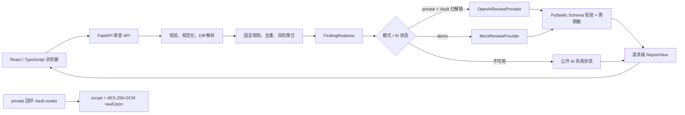

# ReviewLens 规约（SPEC）

**状态：** 已完成 72-hour Release Scope Revision；用户于 2026-08-08 解锁实现阶段。本规约是当前唯一实现基线。

**项目类型：** AI4SE 期末项目 B 类“非 Harness 应用类项目”。
**版本：** 0.1.0-release-scope
**最后更新：** 2026-08-12 01:54:39 +08:00

## 1. 问题、目标与边界

ReviewLens 面向个人学生开发者和小型团队中的单个成员：用户提交一个 Git unified diff，系统只审查本次新增代码，以固定规则给出可重复的风险结论，并可附加一次受约束的 OpenAI 建议。用户可在当前浏览器查看已脱敏结果并下载 Markdown，供课程群、邮件或 PR 等外部渠道共享。

首期是单用户、自托管工具：不提供账号、登录、多租户、团队空间、协作评论、共享链接、报告历史或平台内分享。它不是 Agent：AI 只是一轮无工具、无自主循环、无代码执行的补充调用。

### 1.1 明确不做

- GitHub/GitLab URL、OAuth、仓库授权、远程克隆、用户代码执行；
- Python/Java/Go/C/C++ 专项规则、AST、tokenizer、TypeScript Compiler、ESLint 或外部静态工具；
- JS-007 或任何 explicit-`any` 规则；正式规则仅为 GEN-001…005 与 JS-001…006；
- 自定义 Base URL、第三方兼容 Provider、本地模型、自动切换、自动重试或 AI retry；
- 报告、Finding、Diff 摘要、AI 尝试、历史、数据库、SQLite、SQLAlchemy、Alembic、服务端导出缓存；
- 规则开关、筛选 UI、Finding 豁免、报告重算、团队策略；
- Docker Compose、独立 admin listener/`:8081`、Nginx/DNS/自管 TLS 作为产品前置条件、HTTP 429 作为 v1 验收条件；
- Redis/Celery、微服务、后台 Agent、高并发、99.9% 可用率或完整移动端适配。

## 2. INVEST 用户故事

1. **US-01 — 粘贴审查。** 作为学生开发者，我想粘贴合法 UTF-8 unified diff 并获得确定性结论，以便在提交前发现新增风险。
2. **US-02 — 上传补丁。** 作为开发者，我想上传一个 UTF-8 `.diff` 或 `.patch`，并在大小、编码或格式错误时得到可行动提示。
3. **US-03 — 理解语言覆盖。** 作为多语言提交者，我想看到 JS/TS 专项规则是否启用，以免把能力受限误解为没有风险。
4. **US-04 — 区分结论来源。** 作为审查者，我想分别查看确定性结果和 AI 补充建议，以便区分可重复规则与模型推断。
5. **US-05 — 即时导出。** 作为用户，我想将当前已脱敏报告下载为 Markdown，以便在外部渠道分享，而不让服务器保存报告或完整 Diff。
6. **US-06 — 安全管理凭据。** 作为 private 实例操作者，我想在本机回环入口创建、解锁、更新、锁定和清除 API key，以便公开页面永不暴露真实凭据。
7. **US-07 — 安全公开演示。** 作为课程验收者，我想在公开 URL 使用无状态 Mock Demo 体验流程，以便不访问真实 key 或访客数据。

## 3. 运行模式、架构与 API

### 3.1 模式矩阵

| 能力 | Private | Public Demo |
| --- | --- | --- |
| 确定性规则、去重、风险等级 | 支持 | 支持，相同规则集 |
| AI | 默认 `NOT_CONFIGURED`；解锁 Vault 后单次真实 OpenAI | 固定无网络 `MockReviewProvider` |
| Report、Finding、Diff、摘要 | 仅当前请求/浏览器内存 | 仅当前请求/浏览器内存 |
| Markdown | 浏览器由当前响应即时生成 | 同左 |
| Vault routes | 只在回环绑定的 private app 注册 | 完全不注册 |

Demo 与 private 不共用 Vault 文件、配置或日志。Demo 等价语义是 `APP_MODE=demo`、Mock、无持久化、无凭据路由；private 则通过显式 `APP_MODE=private` 运行。

前端负责输入、当前结果、浏览器导出和 private Vault 页面；不得直接访问 OpenAI。后端是校验、解析、规则、脱敏、Provider、日志和模式边界的唯一权威。

private 直接运行时，**整个 app** 只绑定 `127.0.0.1`、`::1` 或 Unix socket。private Docker 使用单一 `8080` 容器端口，但只发布宿主机 `127.0.0.1:8080:8080`；没有独立 admin 端口。Demo 不注册任何 Vault/private 管理路由；其公开部署只能暴露 demo app。

### 3.2 API Surface

| API | 方法 | Private | Demo | 合同 |
| --- | --- | --- | --- | --- |
| `/health` | GET | 可用 | 可用 | 存活，不依赖 OpenAI |
| `/ready` | GET | 可用 | 可用 | 配置和规则集可接收审查；ready 响应返回非敏感运行时 `mode`（`private` 或 `demo`）；Vault 未解锁不使确定性服务未就绪 |
| `/api/v1/reviews` | POST | 可用 | 可用 | 校验输入、生成已脱敏请求级 `ReportView` |
| 浏览器 Markdown 导出 | 客户端 | 可用 | 可用 | 仅使用当前已脱敏 ReportView，不写服务端缓存 |
| `/admin/v1/vault/status` | GET | 仅 private 回环 app | 不注册 | 仅状态、模型和掩码尾号 |
| `/admin/v1/vault/initialize`、`unlock`、`lock`、`update`、`clear` | POST | 同上 | 不注册 | 隐藏输入、主密码复验、原子写入；不回显 key |

Demo 禁用的路由必须不注册而非仅隐藏。所有错误采用稳定公开码，绝不返回 Diff、未脱敏 Finding、凭据或堆栈。

### 3.3 运行时应用合同

- `create_app(settings: AppSettings) -> FastAPI` 只接收显式已验证设置，且不读取环境变量；
- `load_settings(env)` 是唯一 `APP_MODE` 解析入口；缺失或非法值必须使启动失败；
- `create_runtime_app()` 固定调用 `create_app(load_settings(os.environ))`；生产 ASGI/Docker 仅通过该 factory 启动。

## 4. 功能规约

### 4.1 输入与 Diff 语义

支持网页粘贴 UTF-8 unified diff 或上传一个 UTF-8 `.diff`/`.patch`。最大 500 KB、5,000 行；任一超限即拒绝，不截断。空、非 UTF-8、非法 unified diff、压缩/二进制/多文件上传均拒绝。系统不访问远程仓库，也绝不执行 Diff 内容。

规则只对新增代码行产生 Finding；可读取当前 hunk 的有限上下文帮助判断，但 Finding 必须锚定新增的新文件行号。删除行、上下文、文件头和已移除代码不触发代码 Finding。规模、文件数、生命周期和输入限制使用完整 Diff 元数据；file-level Finding 的行号为 `null`。

### 4.2 规则、去重与风险

通用固定规则为：GEN-001 凭据、GEN-002 危险 shell/数据库操作、GEN-003 TODO/FIXME/HACK、GEN-004 非 loopback `http://`、GEN-005 单文件大变更。JS/TS 专项规则为 JS-001 console、JS-002 debugger、JS-003 direct eval、JS-004 HTML injection sink、JS-005 empty/swallowed catch、JS-006 unhandled fetch。仅 `.ts/.tsx/.js/.jsx` 启用 JS 规则；其他文件仍执行通用规则和可选 AI，并显示能力受限。

固定等级聚合：任一 Critical 为 Critical；否则任一 High 为 High；否则至少 3 个去重 Medium 为 High；否则 Medium；否则至少 5 个去重 Low 为 Medium；否则 Low；无确定性 Finding 为 None。AI Finding 永不改变确定性等级。去重键包含规则、路径、新行号及规范化命中位置；每区按等级、路径、行号、规则号稳定排序。

### 4.3 FindingRedactor

原始 Finding 仅存在于请求内存。去重后、任何 API 响应、页面、浏览器导出、日志和 Provider 载荷之前，必须经 `FindingRedactor`。GEN-001 只保留类别、位置、`redacted=true` 和 `[REDACTED_CREDENTIAL]`；不得出现原值、尾号、摘要或可离线猜测的派生值。AI Finding 的标题、说明、建议和片段也必须再脱敏。Pydantic 校验失败的原始模型输出直接丢弃。

### 4.4 单次 AI 与失败降级

真实 Provider 只有官方 `OpenAIReviewProvider`；Base URL 不可配置。后端调用官方 SDK，前端不得直连。Mock 只用于 CI、离线开发和 Demo，稳定、无网络、不可冒充 OpenAI。

流程固定为：校验/解析 → 确定性规则/去重/聚合 → 脱敏确定性 Finding → 一次 AI 调用或明确不可用状态 → schema 校验与再脱敏 → 返回当前 `ReportView`。AI 不阻塞、推翻或改变确定性结果；不做 retry。

AI 状态至少含 `NOT_CONFIGURED`、`PENDING`、`SUCCEEDED`、`AUTH_FAILED`、`MODEL_UNAVAILABLE`、`RATE_LIMITED`、`TIMEOUT`、`INPUT_TOO_LARGE`、`INVALID_RESPONSE`、`PROVIDER_UNAVAILABLE`。真实请求 30 秒超时。发送给 OpenAI 的内容只限必要 Diff/受控摘要、路径、确定性摘要和输出 schema；若使用 Responses API，必须显式 `store=false`。Diff 内一切文本均是不可信数据，模型只能返回指定 schema、不能调用工具或执行命令。

### 4.5 当前报告与浏览器导出

`ReportView`、文件统计、确定性/AI Finding、等级、AI 状态、Provider/模型和 ruleset 版本是请求级数据模型；服务端不得将其写入数据库、普通文件、缓存、日志、错误响应、备份或镜像。完整 Diff 同样只在本次请求内存短暂存在；Python 运行时不承诺安全擦除。

Markdown 由浏览器从当前已脱敏 `ReportView` 即时生成，包含统计、确定性结论、全部 Finding、AI 建议和能力限制，不包含完整 Diff。刷新/关闭页面后结果消失；用户已下载的副本不受系统控制。

## 5. 凭据保险箱与威胁模型

private Vault 文件为 `data/credentials/vault.json`，只保存版本、scrypt 参数、随机 salt/nonce、AES-256-GCM 密文/标签及非敏感状态。不得保存明文 key、主密码、解密 key、完整 key 日志或缓存。创建/更新使用新 salt/nonce 并临时文件原子替换。

服务默认锁定；解锁 key 只在进程内存，重启和主动锁定均清除。状态仅显示是否存在/解锁、Provider、模型和掩码尾号；更新和清除需复验主密码。错误主密码、损坏密文或认证失败仅返回统一“解锁失败”，记录无凭据安全事件并实施短暂递增延迟。清除 Vault 不影响当前请求外不存在的报告。

主要威胁与对策：Git/镜像/fixture/日志泄露 key 由 Git 忽略私有 Vault、脱敏日志和 Mock CI 处理；公开 Demo 不注册 Vault routes；private app 只经 loopback 暴露；磁盘泄露由主密码 KDF+认证加密缓解；Vault 损坏不允许明文回退。

## 6. 非功能需求

参考环境：2 vCPU、4 GB RAM、Python 3.12、单实例。合法上限内的确定性流程（校验、规范化、解析、规则、去重、聚合、脱敏）目标为 5 秒；Mock Demo 也为 5 秒；真实 AI 仅承诺 30 秒超时后正确降级。性能测试用虚构 Diff，预热后 10 次至少 9 次满足目标。

`/health` 不依赖 OpenAI；`/ready` 检查配置和规则集。日志记录关联 ID、模式、接口、HTTP 状态、输入大小区间、文件数、耗时、AI 状态、公开错误分类、ruleset/app 版本；不得记录完整 Diff、代码片段、key、主密码、完整 prompt/原始响应。基础请求体限制属于部署合理配置；rate limiting 可作为部署 hardening，不是 v1 发布门槛。

核心流程支持键盘操作、明确焦点和标签、非颜色等级文字、不同错误提示、`aria-live`、提交防重、AI 失败不遮挡确定性报告、持续可见 Demo/Mock 和语言能力提示。采用 `linear-app` 信息层级与 `web-design-guidelines`；MUI 仅为组件库。

## 7. 技术、分发与 CI

后端使用 Python 3.12、FastAPI、Pydantic v2、`cryptography`、官方 OpenAI Python SDK、pytest；前端使用 React、TypeScript、Vite、MUI、React Router、原生 `fetch`、Vitest/RTL。**不使用 SQLAlchemy、Alembic、SQLite 或 persistence/repository 层。**

正式分发为一个 `linux/amd64` OCI image：Node 阶段构建 Web，Python 阶段运行 FastAPI，`CMD` 通过 `create_runtime_app` 启动。无需 Compose。真实验收须证明单条 `docker build` 后，Demo 可由单条 `docker run -p 8080:8080 -e APP_MODE=demo ...` 启动；private 由单条 `docker run -p 127.0.0.1:8080:8080 -v reviewlens-private:/data -e APP_MODE=private ...` 启动。Windows 11 x64 + Docker Desktop 是本地支持环境。

镜像必须推送公开 Registry，优先 GHCR。GitHub push/PR Actions 与 NJU GitLab `unit-test` 必须实际运行一键测试，最终均真实 Pass；README 仅在真实产生后列出仓库、镜像和 URL。公共 Demo 由届时用户授权的平台部署，必须 HTTPS、`APP_MODE=demo`、Mock、无状态、无 Vault/private routes，并在截止日前具有真实可访问 WebUI。

## 8. 验收标准

1. 粘贴和单文件 `.diff/.patch` 审查可用；空、编码、格式、500 KB、5,000 行错误可区分并拒绝。
2. 不访问远程仓库、不执行 Diff；删除/上下文/头不触发代码 Finding，新增行号与 file-level `null` 正确。
3. GEN-001…005、JS-001…006 固定；JS 不误用于其他语言；JS-007 不存在。
4. 去重、等级和排序可重复，AI 不影响确定性等级。
5. 脱敏发生在 API、页面、浏览器导出、日志和 OpenAI 载荷前；真实/仿真凭据均不泄漏。
6. 未配置 key、认证/模型/网络/限流/超时/非法输出时仍返回确定性 ReportView；Mock 无网络且稳定。
7. 服务端不保存 Diff、摘要、Report、Finding、AI 尝试或导出缓存；刷新后当前结果消失。
8. private Vault 正确加密、掩码状态、解锁/锁定/更新/清除/重启再锁定均可验证；Demo/private routes 不可从公开 Demo 访问。
9. `/health`、`/ready`、脱敏日志、稳定错误码、键盘流程和重复提交防护符合本规约。
10. 单一 linux/amd64 image 的 Demo/private `docker run` 均可从干净环境启动；镜像不含 Vault、`.env`、真实凭据或 Diff。
11. GitHub Actions、GitLab `unit-test`、公开 Registry、最终 fresh pull/run 与真实 HTTPS 公网 Demo 均有真实证据。
12. 最终 secret scan、clean tree、README、AGENT_LOG、SPEC_PROCESS 与学生本人 Reflection 齐备。

## 9. 风险与限制

规则是保守轻量文本/有限词法检测，可能漏报；README 必须如实说明。AI 可能不可用或变化，故确定性规则是主结论。公开 Demo 依赖用户授权的部署平台；未获得授权前不得伪造 URL。发布前至少锁定 8–10 小时给学生 Reflection、最终 CI、部署复核、secret scan、clean tree 与提交，不得被非 P0 功能侵占。
